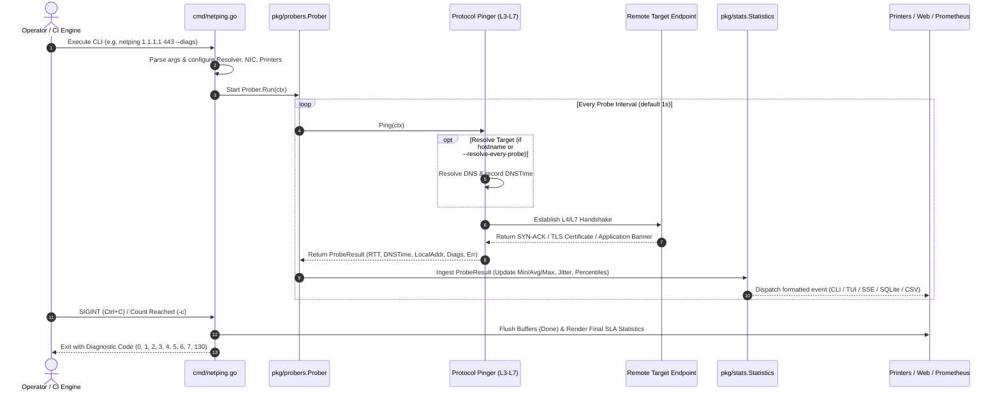
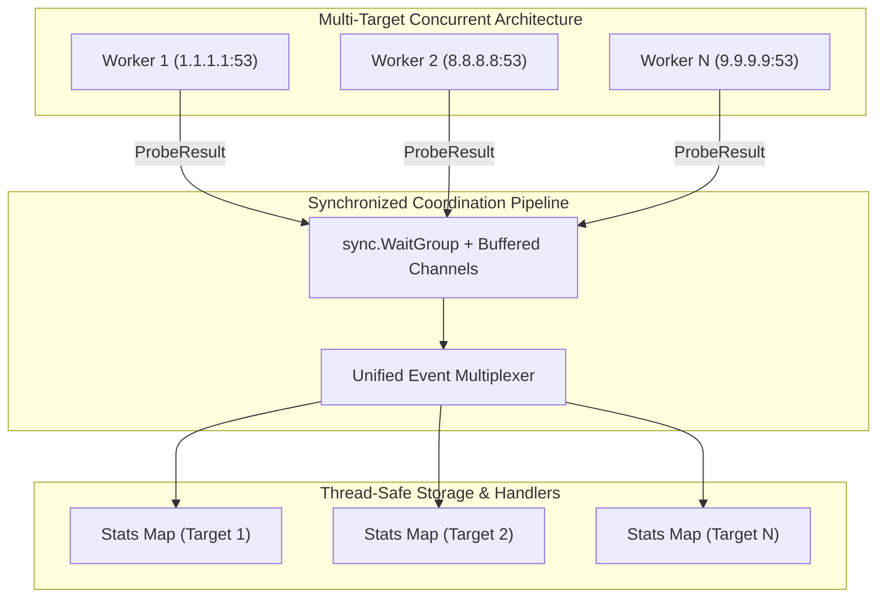
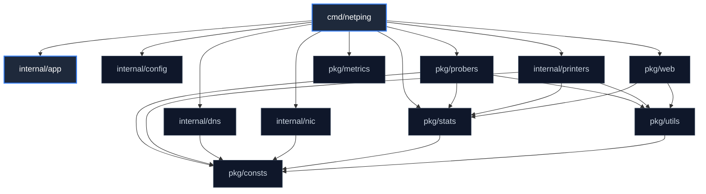
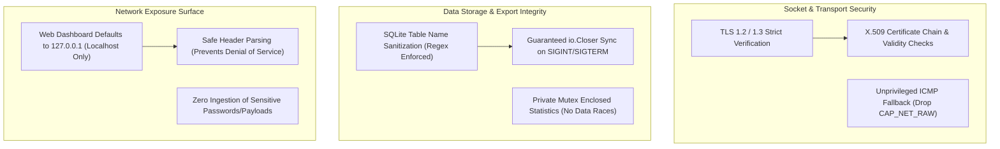

# `netping` — System Architecture & Engineering Specification

This document provides a comprehensive technical breakdown of the **`netping`** architecture, design rationale, concurrency mechanics, data flow pipelines, dependency graphs, performance optimizations, edge case mitigations, and security controls.

---

## 1. Architecture and Design Choices

`netping` is engineered as a zero-dependency, high-throughput network diagnostics and latency measurement engine written in Go. Its core purpose is to provide Layer 3 to Layer 7 latency probing, active protocol diagnostics, and real-time observability while guaranteeing low memory overhead, lock-free telemetry reads, and resilience against transient network failures.

```mermaid
graph TB
    subgraph CLI ["Entrypoint & Orchestration"]
        Entry["cmd/netping.go"]
        Config["internal/config"]
        App["internal/app"]
    end

    subgraph CoreEngine ["Probing Engine & Orchestrator"]
        Prober["pkg/probers.Prober"]
        MultiProber["pkg/probers.MultiProber"]
        PingerContract["pkg/probers.Pinger (Interface)"]
    end

    subgraph Probers ["Protocol-Specific Probers"]
        TCP["pkg/probers/tcp.go"]
        HTTP["pkg/probers/http.go"]
        TLS["pkg/probers/raw_tls.go"]
        UDP["pkg/probers/udp.go"]
        ICMP["pkg/probers/icmp.go"]
        WS["pkg/probers/ws.go"]
        GRPC["pkg/probers/grpc.go"]
        DNSProber["pkg/probers/dns_query.go"]
        DB["pkg/probers/db.go"]
        Cache["pkg/probers/redis.go & memcached.go"]
        Mail["pkg/probers/mail.go"]
        Storage["pkg/probers/storage.go"]
        Queue["pkg/probers/queue.go"]
        Trace["pkg/probers/traceroute.go"]
    end

    subgraph StateTelemetry ["Telemetry & State Machine"]
        Stats["pkg/stats.Statistics (Mutex Protected)"]
        Snapshot["pkg/stats.Snapshot (Immutable Copy)"]
    end

    subgraph OutputSurfaces ["Telemetry Consumers & Outputs"]
        CLIPrinters["internal/printers (Color, Plain, JSON, NDJSON)"]
        StoragePrinters["internal/printers (CSV, TSV, SQLite3)"]
        TUIDashboard["internal/printers/dashboard.go (120-Col TUI)"]
        WebDash["pkg/web (SSE Web Server)"]
        PromMetrics["pkg/metrics (Prometheus Exporter)"]
    end

    Entry --> Config
    Entry --> App
    Entry --> Prober
    Entry --> MultiProber

    Prober --> PingerContract
    MultiProber --> PingerContract
    PingerContract --> TCP
    PingerContract --> HTTP
    PingerContract --> TLS
    PingerContract --> UDP
    PingerContract --> ICMP
    PingerContract --> WS
    PingerContract --> GRPC
    PingerContract --> DNSProber
    PingerContract --> DB
    PingerContract --> Cache
    PingerContract --> Mail
    PingerContract --> Storage
    PingerContract --> Queue
    PingerContract --> Trace

    Prober --> Stats
    Stats -.->|Copy-on-Read| Snapshot

    Snapshot --> CLIPrinters
    Snapshot --> StoragePrinters
    Snapshot --> TUIDashboard
    Snapshot --> WebDash
    Snapshot --> PromMetrics
```



### 1.1. Core Design Patterns

1. **Decoupled Application Orchestration**:
   - `internal/config` is a leaf package dedicated strictly to argument parsing and primitive configuration structures.
   - `cmd/netping.go` acts as the composition root, wiring together DNS resolvers, network interfaces, stats accumulators, output formatters, and prober implementations.
2. **Interface Minimization & Pluggable Probers**:
   - All protocol drivers implement the minimalist `probers.Pinger` interface:
     ```go
     type Pinger interface {
         Ping(ctx context.Context) ProbeResult
     }
     ```
   - Returning `ProbeResult` isolates latency, DNS resolution timing, network interfaces, error categories, and protocol diagnostics from the main timing loop.
3. **Thread-Safe Snapshotting (Copy-on-Read)**:
   - `stats.Statistics` encapsulates all real-time and cumulative counters behind a `sync.RWMutex`.
   - Telemetry consumers (Prometheus scraper, Web UI SSE broadcaster, interactive `Enter` summary keystrokes) read immutable copies generated via `stats.Snapshot()`, eliminating lock contention and blocking delays.

### 1.2. Assumptions

- **Direct Socket Access**: The host OS permits creating Layer 4 TCP/UDP sockets without administrative elevation.
- **ICMP Privilege Fallback**: For Layer 3 ICMP pinging, `netping` assumes unprivileged UDP-based ICMP datagrams on Linux (`net.ipv4.ping_group_range`) or falls back gracefully if raw socket creation (`CAP_NET_RAW` / `Administrator`) is denied.
- **Clock Monotonicity**: Latency timings utilize Go's runtime monotonic clock (`time.Now()` / `time.Since()`), ensuring immunity to OS NTP step adjustments during probe calculations.

### 1.3. Edge Cases & Mitigations

| Edge Case | Failure Mode | Mitigation Strategy | Reference |
| :--- | :--- | :--- | :--- |
| **High-Frequency Socket Exhaustion** | Probing at sub-millisecond intervals (`-i 0.002`) exhausts ephemeral ports, filling OS socket table with `TIME_WAIT`. | Added `--fast-close` (`SO_LINGER=0`), forcing immediate `TCP RST` packets on socket teardown to bypass `TIME_WAIT`. | [`pkg/probers/tcp.go`](pkg/probers/tcp.go) |
| **Anycast / CDN DNS Flapping** | Target IP rotates dynamically under Anycast routing or multi-record DNS configurations. | Added `--resolve-every-probe` to re-query upstream DNS on each cycle and track hostname-to-IP transitions. | [`pkg/probers/probers.go`](pkg/probers/probers.go) |
| **Transient Network Drops** | Brief packet loss or gateway flaps cause false-positive alert cascades. | Exponential backoff engine with randomized full jitter (`--retry`, `--retry-backoff`, `--retry-jitter`) to absorb network burps. | [`pkg/utils/backoff.go`](pkg/utils/backoff.go) |
| **Terminal Width Misalignment** | ANSI escape codes disrupt character counts in variable-width terminal emulators. | Built ANSI-safe width calculation (`padRightVisible`) with automatic ellipsis truncation (`…\033[0m`) guaranteeing strict 120-column table alignment. | [`internal/printers/dashboard.go`](internal/printers/dashboard.go) |
| **Silent Storage Corruption** | Unexpected process exit (SIGINT/SIGTERM) leaves SQLite or CSV write buffers uncommitted. | Enforced `io.Closer` / `Done()` lifecycle with `defer printer.Done()` ensuring all open buffers are synced to disk before termination. | [`internal/printers/csv.go`](internal/printers/csv.go), [`internal/printers/sqlite3.go`](internal/printers/sqlite3.go) |

### 1.4. Performance & Efficiency

- **Zero Allocations in Hot Dial Paths**: Connection buffers and byte arrays for protocol handshakes are preallocated or reused.
- **Bounded Telemetry History**: Historical latency arrays in the TUI dashboard and Web SSE broadcaster are capped (106 samples in terminal, 120 in browser) to prevent memory growth during long-running sessions.
- **SSE Non-Blocking Push**: SSE channels drop slow client connections rather than blocking the real-time probe engine.

---

## 2. Data Flow and Control Logic

### 2.1. Operational Control Flow



### 2.2. Code Relations & Data Sequences

1. **Resolution Stage**: Hostname resolution queries the OS resolver or configured custom DNS server ([`internal/dns/dns.go`](internal/dns/dns.go)). DNS lookup duration is recorded separately as `DNSTime`.
2. **Handshake Stage**: The selected `Pinger` initiates connection with per-probe context timeouts.
   - For **HTTP/HTTPS**: Uses `net/http/httptrace` to isolate DNS, TCP connect, TLS handshake, and Time-To-First-Byte (TTFB).
   - For **Databases & Queues**: Sends native binary greetings (Postgres `SSLRequest`, MySQL `HandshakeV10`, Kafka `ApiVersions`, AMQP `Connection.Start`).
3. **Ingestion & Metric Processing**:
   - Computes RFC 3550 interarrival jitter: $J = J + \frac{(|D| - J)}{16}$.
   - Performs linear percentile interpolation for P50, P90, P95, and P99 SLAs.
   - Categorizes failures (`Connection Refused`, `Connection Timeout`, `Host Unreachable`, `DNS Failed`).
4. **Broadcasting & Output Dispatch**:
   - `PrinterConfig` routes the update to active outputs (Color, Plain, JSON, NDJSON, CSV, TSV, SQLite3, 120-Col Dashboard).
   - If enabled, SSE broadcaster sends real-time JSON payloads to browser clients.

---

## 3. Performance, Scalability & Concurrency Model



### 3.1. Concurrency Mechanics

- **Goroutine per Target Worker**: When executing multi-target probing (`MultiProber`), each target endpoint executes in an isolated worker goroutine with its own ticker and state accumulator.
- **Mutex-Free Broadcast Channel**: The web SSE broadcaster uses buffered event channels per client (`chan ProbeEvent`, buffer size 64). Slow browser clients are non-blockingly dropped if their buffer overflows.
- **Asynchronous User Keyboard Monitor**: An independent goroutine monitors `os.Stdin` for `Enter` key presses to output instant interim statistics snapshots without interrupting the ongoing probe loop.

---

## 4. Package Dependencies & Module Flow

The codebase strictly adheres to a **Directed Acyclic Graph (DAG)**. Leaf packages contain zero domain-logic coupling, and configuration parsing is decoupled from subsystem constructors.



### Dependency Breakdown

| Package | Purpose | Dependencies |
| :--- | :--- | :--- |
| **`cmd/`** | Main entrypoint and composition orchestrator. | `internal/*`, `pkg/*` |
| **`internal/config`** | Pure CLI argument parser and flag validator. | Standard Library only |
| **`internal/app`** | OS signal interception (`SIGINT`/`SIGTERM`) and graceful context shutdown. | Standard Library only |
| **`internal/dns`** | Custom upstream DNS client and resolver caching bypass. | `pkg/consts` |
| **`internal/nic`** | Network interface selector and local IP binding dialer. | `pkg/consts` |
| **`internal/printers`** | Terminal formatting (Color, Plain, JSON, NDJSON, CSV, TSV, SQLite3, Dashboard). | `pkg/stats`, `pkg/utils`, `pkg/consts`, `mattn/go-sqlite3` |
| **`pkg/probers`** | Layer 3 to Layer 7 prober drivers, traceroute, and multi-target orchestrator. | `pkg/stats`, `pkg/utils`, `pkg/consts`, `golang.org/x/net` |
| **`pkg/stats`** | Thread-safe metric accumulators, SLA calculations, and snapshot generator. | `pkg/consts` |
| **`pkg/metrics`** | Zero-dependency Prometheus/OpenMetrics HTTP exporter. | Standard Library only |
| **`pkg/web`** | Zero-dependency embedded web server, SSE broadcaster, and Canvas 2D UI. | `pkg/stats`, `pkg/utils` |
| **`pkg/utils`** | Mathematical jitter, percentiles, sparklines, and backoff helpers. | `pkg/consts` |
| **`pkg/consts`** | Immutable protocol constants, ANSI escape definitions, and exit codes. | Standard Library only |

---

## 5. Security Architecture

`netping` enforces a **defense-in-depth security model** across socket communications, memory management, protocol negotiation, and export boundaries.



### 5.1. Authentication & Protocol Security Layers

- **TLS / SSL Probing**:
  - Validates full X.509 certificate chains, alerting on expired certificates, invalid hostnames, or weak ciphers.
  - Supports testing direct ALPN negotiation (`h2`, `http/1.1`) and extracts certificate expiration dates (`NotAfter`).
- **Database & Application Wire Security**:
  - Probes database ports using safe, unauthenticated protocol handshakes (e.g. Postgres `SSLRequest`, MySQL `HandshakeV10` greeting parsing, MongoDB `isMaster` command).
  - No database credentials, usernames, or sensitive application keys are required or transmitted.
- **Cloud Object Storage (S3 / Azure Blob / GCS)**:
  - Validates storage endpoint availability and measures TTFB using unauthenticated HTTP head/get options without requiring AWS/Azure/GCP secret keys.

### 5.2. Access Control & System Permissions

- **Privilege Separation**:
  - `netping` runs entirely as an **unprivileged user**.
  - For Layer 3 ICMP pinging, it utilizes Linux unprivileged ping sockets (`IPPROTO_ICMP`) or unprivileged UDP sockets, eliminating the need for `setuid root` or `sudo`.
- **Localhost-Bound Telemetry Servers**:
  - The embedded web dashboard (`--web`) defaults strictly to `127.0.0.1:3000` (loopback only) to prevent unauthorized external network access unless explicitly bound to `--web-addr 0.0.0.0:<port>`.
- **SQL Injection Prevention**:
  - SQLite database table names derived from target hostnames are strictly validated against an alphanumeric allowlist regex `^[a-zA-Z0-9_]+$` before execution in DDL statements. Parameterized queries are used for all probe record insertions.
