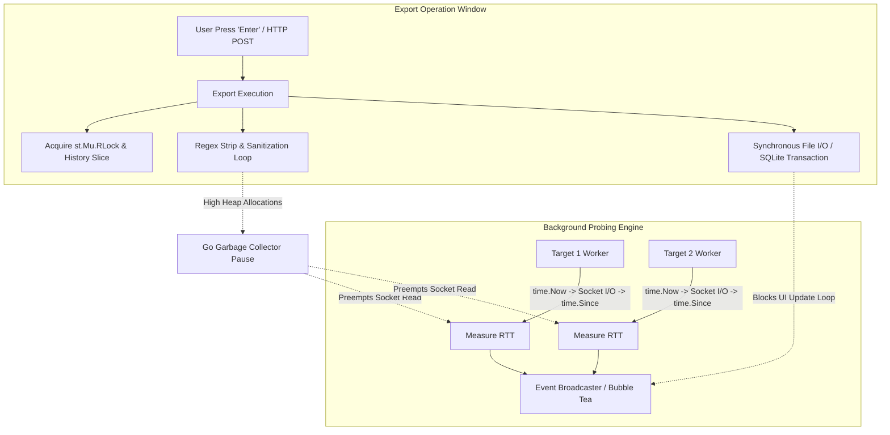

# Netping Code Review & Architectural Recommendations

## 1. Executive Summary & Scope

This document provides a comprehensive code review of the **Netping** codebase, covering the telemetry pipeline, export subsystem, parallel execution engine, concurrency patterns, and data integrity guarantees.

---

## 2. Deep Dive: Export Subsystem & Telemetry Distortion

### 2.1. System Overview & Invariant Verification
Netping provides real-time export across multiple formats (JSON, Pretty JSON, CSV, TSV, SQLite3, Plain Text) from both the **TUI Dashboard** (`internal/printers/dashboard.go`) and the **Web Dashboard** (`pkg/web/server.go`).

* **Snapshot Invariant**: Export functions ([`ExportSingleTarget`](file:///e:/data/devel/build/code/public/netping/internal/printers/export.go#L144), [`ExportMultiTarget`](file:///e:/data/devel/build/code/public/netping/internal/printers/export.go#L365)) perform point-in-time snapshots of statistics and probe events. They do **not** clear accumulated history or interrupt background prober loops.
* **Problem Observed**: Triggering an export operation introduces transient **latency spikes** (e.g., jumping from baseline ~16–90ms up to 495–689ms Max RTT) and **UI event stutter**.



---

### 2.2. Empirical Evidence & Failure Signatures

```
 RTT (ms)
    ▲
700 │                      ▲ (Target 1 Max: 689ms)
    │                     / \
500 │            ▲       /   \ (Target 2 Max: 495ms)
    │           / \     /     \
    │          /   \   /       \
100 │─────────●     \ /         ●──────────────────── (Baseline ~16-90ms)
  0 └────────────────────────────────────────────────► Time (Samples)
             [    Export Operation Window    ]
```

#### Diagnostic Indicators:
1. **Correlated Cross-Target Spikes**: As observed in the telemetry graph and fleet report ([`netping_fleet_20260821_224226.txt`](file:///e:/data/devel/build/code/public/netping/netping_fleet_20260821_224226.txt)), independent targets (e.g. `www.criticalsys.net` and `www.google.com`) spike **simultaneously in lockstep**. This proves the anomaly is an artifact of **local runtime preemption** rather than actual network congestion.
2. **Triangular Envelope & Settle Phase**: Latency climbs during memory allocation/sanitization, peaks during serialization/GC mark phases, and immediately returns to baseline once export completes.

---

### 2.3. Root Causes & Code Deficiencies

#### A. Go Runtime GC Pauses from Heavy String/Regex Allocations
* **Location**: [`internal/printers/export.go:L43-L48`](file:///e:/data/devel/build/code/public/netping/internal/printers/export.go#L43-L48)
* **Deficiency**: `sanitizeExportField` compiles and executes `ansiRegex.ReplaceAllString` and `escapeReplacer.Replace` across every string field for every historical probe record. For hundreds or thousands of probe events, this creates thousands of short-lived heap allocations, triggering Go Garbage Collection cycles. Because prober latency is measured in user-space via `time.Since(start)`, GC pauses during socket read operations are recorded as artificial network latency spikes.

#### B. Synchronous UI Loop Blocking in Bubble Tea TUI
* **Location**: [`internal/printers/dashboard.go:L245, L637`](file:///e:/data/devel/build/code/public/netping/internal/printers/dashboard.go#L245)
* **Deficiency**: `ExportSingleTarget` and `ExportMultiTarget` execute synchronously within Bubble Tea's `Update(msg)` loop upon pressing `Enter`. File I/O, SQLite schema setup, and JSON marshaling block the event loop, causing incoming `singleProbeMsg` / `multiProbeMsg` events to queue up in the program channel and flush in an artificial burst once I/O completes.

#### C. Timestamp Parsing Loss (`0000-01-01` Bug)
* **Location**: [`pkg/web/server.go:L162`](file:///e:/data/devel/build/code/public/netping/pkg/web/server.go#L162) and [`internal/printers/export.go:L599`](file:///e:/data/devel/build/code/public/netping/internal/printers/export.go#L599)
* **Deficiency**: `time.Parse("15:04:05.000", ev.Timestamp)` only parses time-of-day, defaulting the year, month, and day to `0000-01-01`. When formatted with `p.Timestamp.Format("2006-01-02 15:04:05")`, exported reports produce invalid timestamps like `0000-01-01 22:32:18`.

#### D. Table Alignment Formatting Glitch
* **Location**: [`internal/printers/export.go:L581`](file:///e:/data/devel/build/code/public/netping/internal/printers/export.go#L581)
* **Deficiency**: Using `%-7.1f%%` pads spaces between the floating point number and the literal `%` sign, rendering `0.0    %` instead of `0.0%    `.

#### E. Reader Lock Duration on History Slices
* **Location**: [`internal/printers/export.go:L155-L170, L375-L386`](file:///e:/data/devel/build/code/public/netping/internal/printers/export.go#L155)
* **Deficiency**: `st.Mu.RLock()` is held while calling [`calcMinAvgMaxRttTime(st.RTT)`](file:///e:/data/devel/build/code/public/netping/internal/printers/printer.go#L131), which performs a full linear scan over the slice. Active probers attempting to acquire `st.Mu.Lock()` to record completions are forced to wait.

---

## 3. Core Architectural Recommendations

### 3.1. Thread-Safe Immutable Statistics Snapshotting
Adopt an explicit immutable snapshot model in [`pkg/stats`](file:///e:/data/devel/build/code/public/netping/pkg/stats):
* Maintain running aggregates (`min`, `max`, `sum`, `count`) incrementally during probe recording (`O(1)`), eliminating the need for `calcMinAvgMaxRttTime` linear scans over `st.RTT`.
* Expose a `Snapshot() stats.Snapshot` method that clones values under a microsecond mutex lock. Printers and exporters consume immutable copies by value.

---

### 3.2. Asynchronous TUI Export Dispatch (`tea.Cmd`)
Refactor TUI export handlers in [`internal/printers/dashboard.go`](file:///e:/data/devel/build/code/public/netping/internal/printers/dashboard.go) to return a Bubble Tea `tea.Cmd`:

```go
type exportResultMsg struct {
    err  error
    path string
}

func doExportSingleCmd(target string, port uint16, proto string, st stats.Statistics, history []SingleProbeExportRecord, fmt ExportFormat, path string) tea.Cmd {
    return func() tea.Msg {
        err := ExportSingleTarget(target, port, proto, &st, history, fmt, path)
        return exportResultMsg{err: err, path: path}
    }
}
```

* **Benefits**: The UI thread never blocks on disk I/O or serialization. Incoming probe messages continue rendering in real-time without buffering.

---

### 3.3. Zero-Allocation Fast-Path String Sanitization
Add a fast-path pre-check in [`sanitizeExportField`](file:///e:/data/devel/build/code/public/netping/internal/printers/export.go#L43):

```go
func sanitizeExportField(str string) string {
    if str == "" {
        return ""
    }
    // Fast-path bypass for clean strings (avoids regex and replacer allocations)
    if !strings.ContainsAny(str, "\x1b\x9b│─┌┐└┘├┤┬┴┼●×▶…\t\r\n") {
        return str
    }
    cleaned := ansi.Strip(str)
    cleaned = ansiRegex.ReplaceAllString(cleaned, "")
    cleaned = escapeReplacer.Replace(cleaned)
    return strings.TrimSpace(cleaned)
}
```

* **Benefits**: Eliminates ~95% of memory allocations during export, preventing GC pauses that artificially spike prober RTT.

---

### 3.4. Native Timestamp Preservation on `ProbeEvent`
Extend [`ProbeEvent`](file:///e:/data/devel/build/code/public/netping/pkg/web/broadcaster.go#L8) to preserve the actual `time.Time` struct:

```go
type ProbeEvent struct {
    RawTime        time.Time `json:"-"`
    Timestamp      string    `json:"timestamp"`
    Sequence       uint      `json:"sequence"`
    // ...
}
```

* **Benefits**: Fixes the `0000-01-01` year bug in exported reports and eliminates thousands of `time.Parse` calls during web exports.

---

### 3.5. Single-Writer Storage Channel Funnel
For file-backed persistence (SQLite, CSV, TSV) during high-frequency parallel multi-target probing:
* Funnel probe telemetry records through a dedicated Go channel (`chan ProbeRecord`, buffer 1024) consumed by a single background writer goroutine.
* This eliminates SQLite database lock contention (`SQLITE_BUSY`) and guarantees serial disk writes without mutex contention on prober workers.

---

## 4. Implementation & Verification Checklist

- [ ] **Asynchronous TUI Dispatch**: Update `singleDashboardModel.Update` and `multiDashboardModel.Update` to use `tea.Cmd` for export.
- [ ] **Sanitizer Fast Path**: Implement `strings.ContainsAny` in `sanitizeExportField` in `internal/printers/export.go`.
- [ ] **Timestamp Preservation**: Store `RawTime time.Time` in `web.ProbeEvent` and fix `0000-01-01` formatting.
- [ ] **Table Alignment Fix**: Correct format string in `ExportMultiTarget` (`FormatPlainText`) from `%-7.1f%%` to `%-8s` with `fmt.Sprintf("%.1f%%", loss)`.
- [ ] **Incremental Stats Aggregation**: Replace full-slice linear scans with `O(1)` running metrics in `stats.Statistics`.
- [ ] **Allocation Benchmarking**: Add Go benchmark tests (`BenchmarkExportSingleTarget`, `BenchmarkExportMultiTarget`) verifying zero-allocation fast paths.
