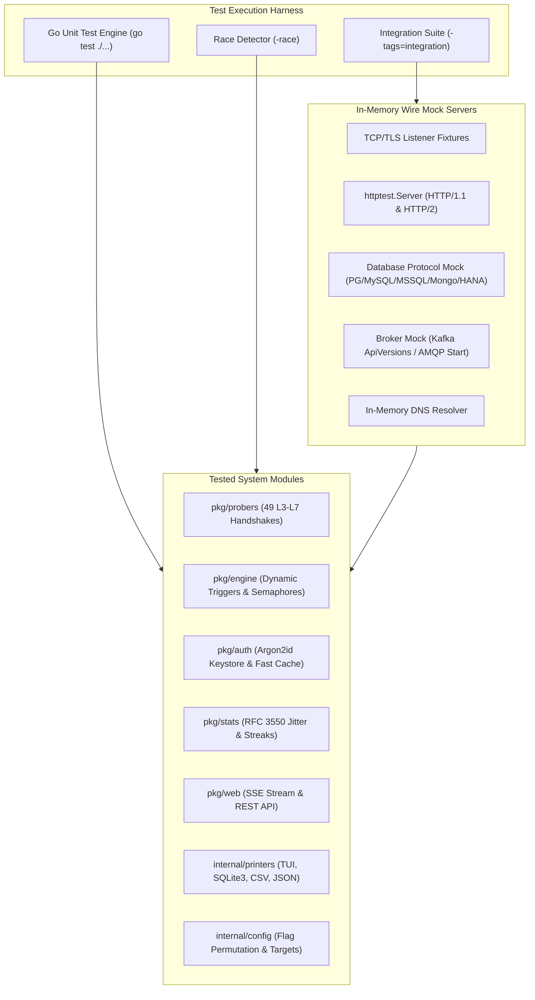
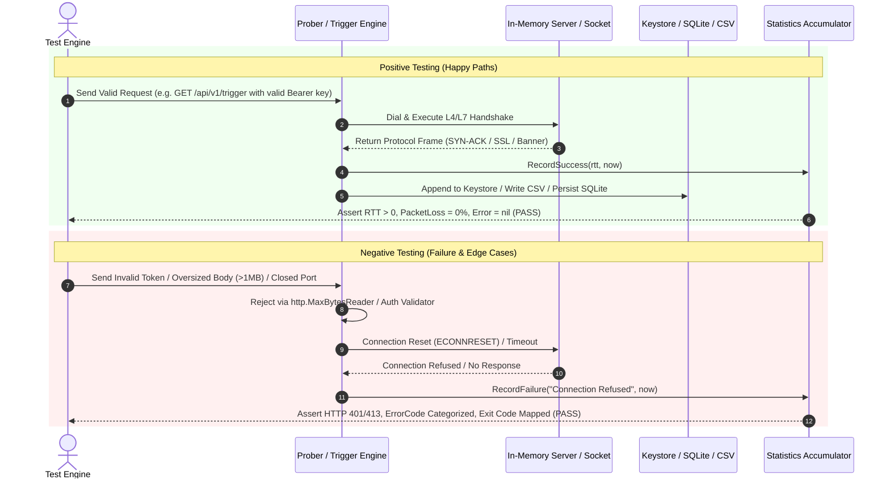

# `netping` — Testing Strategy, Architecture & Verification Guide

This document outlines the testing architecture, suite structure, positive/negative logic flows, technical requirements, comprehensive test registry, code coverage benchmarks, and troubleshooting procedures for **`netping`**.

---

## 1. Architecture, Design and Principles of the Test Suite

`netping` is designed for high-precision network diagnostics, active telemetry collection, and dynamic REST triggering. The testing suite guarantees sub-millisecond accuracy, zero memory corruption, deterministic failure isolation, and zero data races across Linux and Windows environments.

### Core Testing Principles
1. **Deterministic Execution**: Zero flaky tests. Timeouts, backoffs, and retries use controllable monotonic clocks and explicit context deadlines.
2. **Isolation & Ephemeral Artifacts**: All filesystem outputs (CSV, TSV, SQLite3, Keystores) write strictly to temporary directories created via `t.TempDir()`.
3. **Zero Data Races**: Every package must execute cleanly under Go's race detector (`go test -race`).
4. **Wire-Level Mock Protocol Handshakes**: All 51 Layer 3 to Layer 7 probers are validated against in-memory TCP/TLS/HTTP/DNS mock servers simulating real-world server responses, handshake errors, and latency breakdowns.
5. **Memory Sanitization Validation**: Cryptographic buffers containing raw API keys are validated for zero-byte memory overwriting (`auth.ZeroBytes`).



### 1.1. Test Suite Directory Structure

```
netping/
├── cmd/
│   └── netping_test.go          # Full 8-stage lifecycle, 49-protocol coverage, and payload limits.
├── internal/
│   ├── app/app_test.go          # Signal context trapping & cancellation lifecycle.
│   ├── config/config_test.go    # CLI flags, argument permutation, and target matrix.
│   ├── config/helpers_test.go   # URI schemas, host:port parsing, and version comparator.
│   ├── dns/dns_test.go          # Custom nameservers, dual-stack filtering, and retry backoff.
│   ├── nic/nic_test.go          # Outbound network interface binding & dialer construction.
│   └── printers/*_test.go       # Plain, JSON, NDJSON, CSV, TSV, SQLite3, and TUI models.
├── pkg/
│   ├── auth/auth_test.go        # Argon2id token generation, keystores, and fast-path cache.
│   ├── consts/protocols_test.go # Protocol aliases, default IANA ports, and enums.
│   ├── engine/engine_test.go    # Dynamic trigger execution, worker semaphores, and SLA alarms.
│   ├── metrics/prometheus_test.go # OpenMetrics formatting, scrape endpoints, and histograms.
│   ├── probers/factory_test.go  # Centralized prober builder pattern validation across 51 protocols.
│   ├── probers/kerberos_test.go # RFC 4120 Kerberos v5 mock TCP/UDP KDC server, clock skew, and ASN.1 dissection.
│   ├── probers/probers_test.go  # Wire-level mock servers for databases, queues, mail, HTTP method dispatch, and web.
│   ├── stats/stats_test.go      # RFC 3550 jitter calculation, streak tracking, and snapshots.
│   ├── utils/utils_test.go      # Percentile ranks, error taxonomy classifiers, and sparklines.
│   └── web/server_test.go       # Embedded Web dashboard, SSE broadcaster, and REST endpoints.
└── tests/
    └── integration/             # End-to-end multi-target probing, fleet monitoring, and stress tests.
```

---

## 2. Logic Flow of the Tests: Main Categories & Assertions

Testing covers four primary execution tiers with distinct positive and negative testing paths:



---

## 3. Technical Requirements and Setup

### 3.1. Environment Requirements
- **Go Runtime**: Go 1.22 or higher.
- **Operating System**: Windows (PowerShell) or Linux (Bash/POSIX).
- **Environment Variables**:
  - `CGO_ENABLED=0` (Supported; entire test suite runs without native C compiler).
  - `PAGER=cat` (Ensures non-paging execution in automated CI runners).

### 3.2. Constraints & Policies
- **No Residual Files**: Never write files to working repository directories during tests; always use `t.TempDir()`.
- **Parallel Execution Safety**: All tests calling `t.Parallel()` must use private instances of `stats.Statistics`, `web.Broadcaster`, and `engine.DynamicTargetRegistry`.

---

## 4. List of Tests

### 4.1. Unit & Component Test Registry

| Logical Group | Test Name | Technical Purpose / Description | Success Criteria (PASS/FAIL) |
| :--- | :--- | :--- | :--- |
| **Authentication** | `TestGenerateAPIKey_Entropy` | Generates 32-byte CSPRNG token with `np_live_` prefix and Argon2id hash. | PASS if prefix matches, key length = 56, and Argon2id hash validates. |
| **Authentication** | `TestVerifyKey_CacheAcceleration` | Asserts in-memory cache accelerates repeated token verification ($<1\mu\text{s}$). | PASS if cache hit matches verified key and cache clear forces re-hash. |
| **Authentication** | `TestKeystore_HotReload` | Writes new key to store file and verifies automatic reload on next lookup. | PASS if new key resolves without restarting service. |
| **Authentication** | `TestZeroBytes_Scrubbing` | Verifies cryptographic buffer zeroing in RAM after hashing operations. | PASS if memory slice contains strictly `0x00` bytes post-scrub. |
| **CLI & Dispatch** | `TestDiagnosticExitCodes` | Verifies exit code mapping constants for usage, storage, and timeout errors. | PASS if ExitGeneralError=1, ExitUsageError=2, ExitStorageError=7. |
| **CLI & Security** | `TestTrigger_OversizedPayload_MaxBytesProtection` | Posts 2MB payload to `/api/v1/trigger` enforcing 1MB boundary limit. | PASS if server returns HTTP 400/413 Bad Request without memory bloat. |
| **Configuration** | `TestFlagsRequiringValue` | Validates value-requiring flag set against command-line registrations. | PASS if all non-boolean flags expect trailing value arguments. |
| **Configuration** | `TestResolveTargetPool` | Validates Cartesian matrix expansion across hosts, ports, and protocols. | PASS if multi-target arrays expand correctly with default ports. |
| **Configuration** | `TestParseHostPort` | Validates host:port parsing, IPv6 bracket extraction, and default port fallback. | PASS if IPv4/IPv6 strings split cleanly to valid host and uint16 port. |
| **Configuration** | `TestCheckForUpdates` | Simulates GitHub release API response parsing and version comparison. | PASS if semantic version comparison correctly identifies newer releases. |
| **DNS Resolution** | `TestDNSDialAddress` | Validates custom nameserver address normalization (`host`, `IP:port`). | PASS if IPv4/IPv6 custom DNS strings parse to valid dial endpoints. |
| **DNS Resolution** | `TestCustomDNSLookup_Fallback` | Tests resolution fallback to system resolver on custom DNS timeout. | PASS if resolver falls back gracefully and records resolution duration. |
| **Network Interface** | `TestNewNetworkInterface_ValidLocalIP` | Tests outbound socket binding to host loopback / active NIC addresses. | PASS if dialer.LocalAddr binds cleanly to designated local IP. |
| **Network Interface** | `TestNewNetworkInterface_AutoDetect` | Verifies auto-detection of default outbound network interface and gateway. | PASS if non-empty local IP is selected without errors. |
| **Printers (TUI)** | `TestSparklineRenderingModes` | Tests `shouldUseCompatGlyphs()` across environment overrides and modern/fallback block glyph sets. | PASS if legacy 3-glyph and modern 8-glyph modes render accurately. |
| **Probers (Factory)** | `TestBuildPinger_AllProtocols` | Instantiates prober instances across all 51 supported protocols. | PASS if BuildPinger produces non-nil Pinger for every protocol constant. |
| **Probers (Kerberos)**| `TestBuildKerberosASREQ` | Validates RFC 4120 DER `AS-REQ` generation with nonce, timestamp, and cipher suites. | PASS if `[APPLICATION 10]` DER packet is generated with principal and realm. |
| **Probers (Kerberos)**| `TestKerberos_ErrorCodeNames` | Validates mapping table for RFC 4120 symbolic error names (0 through 76+). | PASS if all standard error codes resolve to correct symbolic names. |
| **Probers (Kerberos)**| `TestKerberos_ETypeNames` | Validates cipher suite name table (AES256, AES128, RC4, Camellia, DES). | PASS if all 11 cipher identifiers map to standard names. |
| **Probers (Kerberos)**| `TestKerberos_DefaultOptions` | Validates default Port 88, hostname realm fallback, and custom port configuration. | PASS if Port 88 and uppercase realm defaults apply cleanly. |
| **Probers (Kerberos)**| `TestKerberos_DissectKRBError` | Dissects ASN.1 `KRB-ERROR` context tags (error code, realm, SPN, timestamp, PA-DATA). | PASS if all fields and supported PA-DATA methods are extracted. |
| **Probers (Kerberos)**| `TestKerberos_ASN1Helpers_WrapAndLength` | Validates DER length encoding across short (<128), medium (128-255), and long (>255) bounds. | PASS if ASN.1 length bytes encode and decode with zero buffer overflows. |
| **Probers (Kerberos)**| `TestKerberos_ASN1Helpers_Parsers` | Tests ASN.1 integer, string, generalized time, and principal name primitives. | PASS if all ASN.1 data types parse with boundary protection. |
| **Probers (Kerberos)**| `TestKerberos_ParseEDataPAData_AllTypes` | Validates PA-DATA sequence extraction for timestamp, etype-info2, and FAST armoring. | PASS if all pre-auth mechanisms and cipher suites are enumerated. |
| **Probers (Kerberos)**| `TestKerberos_ClockSkewCriticalAlert` | Tests microsecond clock skew calculation and $|\Delta t| \ge 300\text{s}$ warning trigger. | PASS if critical alert string is appended on $\ge 300\text{s}$ drift. |
| **Probers (Kerberos)**| `TestKerberos_UnexpectedResponses` | Asserts negative handling on short payloads, invalid application tags, and fatal errors. | PASS if malformed/unexpected responses return descriptive errors. |
| **Probers (Kerberos)**| `TestKerberos_TCP_MockServer_KRBError` | In-memory TCP mock server validating 4-byte stream framing and `--diags` telemetry. | PASS if TCP length framing exchanges and diagnostics are populated. |
| **Probers (Kerberos)**| `TestKerberos_TCP_MockServer_ASRep` | In-memory TCP mock server validating `AS-REP` ticket delivery response. | PASS if `Msg: AS-REP (11) │ Status: OK` is reported. |
| **Probers (Kerberos)**| `TestKerberos_TCP_InvalidLengthHeader`| Validates TCP stream framing protection against oversized length headers (>65536). | PASS if prober aborts and returns invalid length error. |
| **Probers (Kerberos)**| `TestKerberos_UDP_MockServer_KRBError` | In-memory UDP mock server validating raw datagram exchange and `KRB-ERROR` parsing. | PASS if UDP datagram transmits, parses, and computes latency. |
| **Probers (Kerberos)**| `TestKerberos_Timeout` | Validates context deadline expiration when KDC does not respond. | PASS if timeout error is returned cleanly without goroutine leak. |
| **Probers (SSO)**     | `TestSSO_OIDC_Discovery_And_JWKS` | Mock OIDC discovery JSON and JWKS server extracting signing algs, scopes, and key cert validity. | PASS if issuer, endpoints, signing algorithms, and nearest cert expiry days are decoded. |
| **Probers (SSO)**     | `TestSSO_OIDC_Expired_And_Warning_JWKS` | Validates JWKS cert expiration calculation and `<30d` warning / expired critical alerts. | PASS if `[CRITICAL: Cert Expired]` and `[WARNING: Nearest Cert Expires in X days]` trigger. |
| **Probers (SSO)**     | `TestSSO_SAML2_Metadata_ValidCert` | Mock SAML 2.0 XML metadata server parsing EntityID, SSO bindings, NameID formats, and signing cert. | PASS if XML DOM parses and valid certificate validity window is extracted. |
| **Probers (SSO)**     | `TestSSO_SAML2_Metadata_ExpiringSoon_And_Expired` | Validates SAML signing cert expiration alerts for expiring `<30d` and expired certificates. | PASS if `[WARNING: X days left]` and `[CRITICAL: EXPIRED on YYYY-MM-DD]` are flagged. |
| **Probers (SSO)**     | `TestSSO_OAuth2_AuthorizationServer` | Mock RFC 8414 OAuth 2.0 AS server dissecting token endpoints, grants, auth methods, and PKCE S256. | PASS if all RFC 8414 metadata fields are extracted and `PKCE: [S256]` is verified. |
| **Probers (SSO)**     | `TestSSO_OAuth2_Missing_S256` | Tests RFC 8414 metadata without S256 PKCE support flagging missing security warning. | PASS if `PKCE: [plain only - S256 missing]` notice is rendered. |
| **Probers (SSO)**     | `TestSSO_AutoDetection` | Tests automatic protocol deduction from URI paths (`/metadata.xml`, `/oauth/token`, etc.). | PASS if OIDC, SAML, and OAuth2 types are inferred accurately from path. |
| **Probers (SSO)**     | `TestSSO_ErrorHandling_And_Non200` | Tests HTTP 500 error status responses and missing target configuration errors. | PASS if non-success status codes return structured errors without crashing. |
| **Probers (SSO)**     | `TestSSO_Factory_Integration` | Validates BuildPinger instantiation for OIDC, SAML, OAUTH2, and SSO protocol constants. | PASS if BuildPinger produces initialized SSOing instances. |
| **Probers (HTTP/S)** | `TestHTTPing_Ping_Success` | Probes mock HTTP server collecting DNS, TCP, TLS, and TTFB trace timings. | PASS if TTFB > 0, HTTPStatus = 200, and RTT is within bounds. |
| **Probers (HTTP/S)** | `TestHTTPing_SendDataAndExpectData` | Validates method dispatch (HEAD default, POST with body, GET with expect substring matching). | PASS if POST transmits payload and GET asserts expected response substring. |
| **Probers (Database)** | `TestDBing_Postgres_Handshake` | Simulates PostgreSQL SSLRequest and StartupMessage protocol handshakes. | PASS if SSL capability and server version are parsed into Diagnostics. |
| **Probers (Database)** | `TestDBing_MySQL_Handshake` | Simulates MySQL HandshakeV10 greeting frame decoding. | PASS if proto version, thread ID, and auth plugin are extracted. |
| **Probers (Database)** | `TestDBing_MSSQL_Handshake` | Simulates MSSQL TDS 7.x/8.0 PRELOGIN token exchange. | PASS if server response token is recognized and parsed. |
| **Probers (Database)** | `TestDBing_MongoDB_Handshake` | Simulates MongoDB OP_QUERY `isMaster` wire handshake. | PASS if wire reply is parsed and latency recorded. |
| **Probers (Database)** | `TestDBing_SAPHANA_Handshake` | Simulates SAP HANA SQL segment connection handshake. | PASS if connect acknowledge segment is recognized. |
| **Probers (Queue)** | `TestQueueProber_Kafka` | Validates Kafka `ApiVersions` request wire protocol negotiation. | PASS if API version response header is decoded without auth. |
| **Probers (Queue)** | `TestQueueProber_RabbitMQ` | Validates AMQP 0-9-1 `Connection.Start` frame exchange. | PASS if broker version string is extracted into Diagnostics. |
| **Probers (Mail)** | `TestMailProber_SMTP_STARTTLS` | Simulates SMTP 220 banner parsing and STARTTLS command sequence. | PASS if TLS upgrade succeeds and cipher suite is reported. |
| **Probers (Storage)** | `TestStorageProber_S3_Azure_GCS` | Simulates unauthenticated bucket HEAD requests to AWS/Azure/GCS endpoints. | PASS if endpoint latency is recorded and HTTP headers are captured. |
| **Probers (Directory)** | `TestLDAPProber_Handshake` | Simulates LDAP anonymous bind / root DSE search frame exchange. | PASS if LDAP search response is recognized. |
| **Probers (Traceroute)**| `TestRunTraceroute_Loopback` | Executes TTL-incrementing Layer-4 TCP probe sequence. | PASS if consecutive hops return TTL-exceeded / SYN-ACK responses. |
| **Statistics** | `TestRecordSuccess_RFC3550Jitter` | Validates running latency aggregates and RFC 3550 jitter calculation. | PASS if Jitter adheres to $J_i = J_{i-1} + (|D| - J_{i-1})/16$. |
| **Statistics** | `TestSnapshot_Immutability` | Verifies copy-on-read snapshot safety under concurrent write operations. | PASS if reading snapshot values causes zero race conditions. |
| **Statistics** | `TestStreakTracking` | Tracks consecutive success and failure streak counters. | PASS if streaks reset accurately on state transitions. |
| **Metrics** | `TestPrometheusExporter` | Scrapes GET `/metrics` verifying OpenMetrics syntax and gauge values. | PASS if `netping_up`, `netping_probe_duration_seconds` are exported. |
| **Dynamic Engine** | `TestDynamicEngineTCPExecution` | Dispatches dynamic probe request through worker semaphore. | PASS if TriggerResponse returns success and registers target in fleet. |
| **Dynamic Engine** | `TestDynamicEngine_ConcurrencyLimit` | Validates worker semaphore rejection under saturated context cancellation. | PASS if canceled request aborts immediately without leaked slots. |
| **Dynamic Engine** | `TestDynamicEngine_TracerouteExecution` | Triggers dynamic traceroute via DynamicEngine. | PASS if hops array is returned in TriggerResponse. |
| **Dynamic Engine** | `TestDynamicEngine_MultipleProbes` | Triggers multi-probe execution (count=3) with per-probe breakdown. | PASS if resp.Probes contains exactly 3 probe results. |
| **Dynamic Engine** | `TestDynamicEngine_SSO_All3Protocols_Execution` | Dispatches dynamic on-demand trigger probes across OIDC, SAML, and OAuth 2.0. | PASS if all 3 protocols execute through DynamicEngine and return status 200 + diagnostics. |
| **Web & SSE** | `TestBroadcaster_BroadcastAndSubscribe` | Streams real-time ProbeEvents to concurrent SSE subscriber channels. | PASS if subscriber receives event payload with identical sequence number. |
| **Web & SSE** | `TestBroadcaster_Concurrent` | Streams high-volume events across 50 concurrent SSE subscriber goroutines. | PASS if zero deadlocks, zero dropped events, and zero race conditions occur. |
| **Web Server** | `TestWebServer_REST_Endpoints` | Tests `/api/v1/health`, `/api/v1/targets`, `/api/v1/metrics`, `/api/v1/probes`. | PASS if all endpoints return valid JSON and HTTP 200. |
| **Web Server** | `TestWebServer_TriggerAPI` | Posts probe trigger to `/api/v1/trigger` with Bearer auth. | PASS if probe executes and broadcasts to SSE stream. |
| **Printers & Export** | `TestExportSingleTarget_Formats` | Exports historical telemetry into CSV, TSV, JSON, and SQLite3 files. | PASS if generated files are non-empty and ANSI box characters are stripped. |
| **Utilities** | `TestCalculatePercentile` | Calculates P50, P90, P95, and P99 SLAs using linear interpolation. | PASS if percentile values match exact mathematical interpolation. |
| **Utilities** | `TestClassifyError` | Maps OS socket error strings to canonical error taxonomy codes. | PASS if `ECONNREFUSED` maps to `"Connection Refused"`. |

---

### 4.2. End-to-End (E2E) & Integration Test Registry (`tests/integration/`)

All integration and E2E tests are executed with `-tags=integration` and probe against live production endpoints and local multi-target test harnesses:

| Category | Test Function Name | Target Service / Wire Protocol | Verification Scope & Success Criteria |
| :--- | :--- | :--- | :--- |
| **L7 Web Protocols** | `TestLive_HTTP_Cloudflare` | `one.one.one.one:80` (HTTP) | PASS if HTTP status, TTFB, and server headers are parsed. |
| **L7 Web Protocols** | `TestLive_HTTPS_Cloudflare` | `one.one.one.one:443` (HTTPS) | PASS if TLS 1.3 certificate expiration and cipher suite are extracted. |
| **L7 Web Protocols** | `TestLive_WebSocket_Echo` | `echo.websocket.events:443` (WSS) | PASS if WebSocket 101 Switching Protocols handshake completes. |
| **L7 Web Protocols** | `TestLive_gRPC_GooglePubSub` | `pubsub.googleapis.com:443` (gRPC) | PASS if HTTP/2 frame and ALPN `h2` negotiation complete. |
| **DNS Resolution** | `TestLive_DNS_UDP_Google` | `8.8.8.8:53` (DNS UDP) | PASS if standard DNS query resolves with NOERROR RCODE. |
| **DNS Resolution** | `TestLive_DNS_DoT_Cloudflare` | `1.1.1.1:853` (DNS over TLS) | PASS if TLS wrapped DNS query negotiates successfully. |
| **DNS Resolution** | `TestLive_DNS_DoH_Cloudflare` | `1.1.1.1:443` (DNS over HTTPS) | PASS if DoH HTTP/2 GET wire query returns valid answer. |
| **Cloud Storage** | `TestLive_Storage_S3` | `s3.amazonaws.com:443` (S3) | PASS if AWS S3 endpoint responds with HTTP 200/403/307. |
| **Cloud Storage** | `TestLive_Storage_AzureBlob` | `blob.core.windows.net:443` (Blob) | PASS if Azure Storage responds with HTTP status. |
| **Cloud Storage** | `TestLive_Storage_GCS` | `storage.googleapis.com:443` (GCS) | PASS if Google Cloud Storage responds with HTTP status. |
| **Enterprise Cloud**| `TestLive_O365_Graph` | `graph.microsoft.com:443` (O365) | PASS if Microsoft 365 endpoint negotiates TLS and returns HTTP status. |
| **Directory Services**| `TestLive_LDAP_ForumSys` | `ldap.forumsys.com:389` (LDAP) | PASS if LDAP root DSE search packet responds. |
| **Directory Services**| `TestLive_LDAPS_ForumSys` | `ldap.forumsys.com:636` (LDAPS) | PASS if LDAPS TLS tunnel establishes and returns root DSE. |
| **Mail & Transport**| `TestLive_Mail_SMTP_STARTTLS`| `smtp.gmail.com:587` (SMTP) | PASS if 220 banner is read and STARTTLS command sequence succeeds. |
| **Mail & Transport**| `TestLive_Mail_SMTPS` | `smtp.gmail.com:465` (SMTPS) | PASS if implicit SMTPS TLS handshake completes. |
| **Mail & Transport**| `TestLive_Mail_IMAPS` | `imap.gmail.com:993` (IMAPS) | PASS if IMAP over TLS greeting is decoded. |
| **Mail & Transport**| `TestLive_Mail_POP3S` | `pop.gmail.com:995` (POP3S) | PASS if POP3 over TLS `+OK` greeting is decoded. |
| **Remote Access** | `TestLive_SSH_GitHub` | `github.com:22` (SSH) | PASS if SSH-2.0 banner (`SSH-2.0-babeld-...`) is extracted into Diags. |
| **File Transfer** | `TestLive_FTP_Rebex` | `test.rebex.net:21` (FTP) | PASS if FTP 220 greeting banner is captured. |
| **Databases** | `TestLive_DB_PostgreSQL` | Local PG Mock (`:5432`) | PASS if SSLRequest and StartupMessage exchanges succeed. |
| **Databases** | `TestLive_DB_MySQL` | Local MySQL Mock (`:3306`) | PASS if HandshakeV10 greeting frame decodes server version. |
| **Databases** | `TestLive_DB_MSSQL` | Local MSSQL Mock (`:1433`) | PASS if TDS 7.x/8.0 PRELOGIN token frame exchanges. |
| **Databases** | `TestLive_DB_Oracle` | Local Oracle Mock (`:1521`) | PASS if TNS connect request handshake completes. |
| **Databases** | `TestLive_DB_SAPHANA` | Local SAP HANA Mock (`:30015`) | PASS if SAP HANA SQL segment connection acknowledges. |
| **Databases** | `TestLive_DB_SAPHANA_Port39013`| Local SAP HANA Mock (`:39013`)| PASS if SAP HANA secondary instance port connects cleanly. |
| **Database Fleet** | `TestLive_DB_All5Protocols_Concurrent_E2E` | 5 Databases Concurrent | PASS if PG, MySQL, MSSQL, Oracle, and HANA probe concurrently without errors. |
| **CLI E2E** | `TestLive_CLI_FlagCombinations_E2E` | Full CLI Flag Permutations | PASS across 15+ sub-tests: `--diags`, `--json`, `--db`, `--fast-close`, `--retry`. |
| **Fleet E2E** | `TestLive_MultiTarget_Parallel_Fleet_E2E`| Multi-Target Fleet Probing | PASS if workers probe in parallel and aggregate into MultiTargetSummary. |
| **Export E2E** | `TestLive_MultiTarget_Outputs_AllFormats_E2E` | CSV, TSV, SQLite3, JSON, NDJSON | PASS across all 5 sub-tests: all files parse structurally without data loss. |
| **Kerberos KDC** | `TestLive_Kerberos_TCP_E2E` | MIT KDC Container (`:88` TCP) | PASS if TCP 4-byte framing connects, receives `KRB-ERROR`/`AS-REP`, and parses realm. |
| **Kerberos KDC** | `TestLive_Kerberos_UDP_E2E` | MIT KDC Container (`:88` UDP) | PASS if UDP datagram exchanges with KDC container and extracts diagnostics. |
| **Kerberos KDC** | `TestLive_Kerberos_CLI_Diags_E2E`| CLI Subprocess with `--diags` | PASS if CLI output contains `[DIAG]`, `Kerberos v5`, `ClockSkew:`, and Realm. |
| **SSO / OIDC**   | `TestLive_SSO_OIDC_Google_E2E` | Live OIDC (`accounts.google.com`) | PASS if HTTP 200, Issuer, TokenEndpoint, and JWKS key count are decoded. |
| **SSO / SAML**   | `TestLive_SSO_SAML_Microsoft_E2E` | Live SAML (`login.microsoftonline.com`) | PASS if HTTP 200, EntityID, SSO Bindings, and Signing Certificate are extracted. |
| **SSO / OAuth2** | `TestLive_SSO_OAuth2_Microsoft_E2E` | Live OAuth 2.0 (`login.microsoftonline.com`) | PASS if HTTP 200, RFC 8414 TokenEndpoint, and AuthMethods are parsed. |
| **SSO / CLI**    | `TestLive_SSO_CLI_Diags_E2E` | CLI Subprocess (`--protocol oidc --diags`) | PASS if CLI output contains `[DIAG]`, `Protocol: OIDC`, `Issuer:`, and `JWKS:`. |
| **Web REST E2E** | `TestLive_Web_REST_API_Full_E2E` | Live Embedded Web & REST API | PASS across all 10 sub-tests: Dashboard, Health, Metrics, Targets, Probes, SSE, Export, Reset. |

---

### 4.3. Kerberos KDC Container E2E Integration Suite

The Kerberos End-to-End integration suite tests live Key Distribution Center (KDC) authentication handshakes, transport framing, and deep diagnostics against an automated MIT Kerberos container (`gcavalcante8808/krb5-server:latest`).

#### Container Topology & Environment:
- **Image**: `gcavalcante8808/krb5-server:latest`
- **Container Name**: `kdc-e2e-server`
- **Exposed Ports**: `88/tcp` (TCP stream framing) and `88/udp` (raw datagrams)
- **Environment Variables**:
  - `KRB5_REALM=EXAMPLE.COM`
  - `KRB5_KDC=127.0.0.1`
  - `KRB5_PASS=AdminPassword123!`

#### Cross-Platform Host Resolution (`getKDCHost()`):
- **Windows (WSL2 Docker)**: Targets `dockerHost` (`cs-main-wsl001.csysinet.com` / WSL virtual switch IP) to ensure UDP datagrams cross the Hyper-V virtual adapter boundary (since WSL2's localhost proxy forwards only TCP).
- **Linux (Native Docker)**: Targets `127.0.0.1` directly on the local network namespace.

#### Running Kerberos Integration Tests:
```bash
go test -tags=integration -v ./tests/integration -run "TestLive_Kerberos"
```

#### Verified Test Scenarios:
1. **`TestLive_Kerberos_TCP_E2E`**: Establishes TCP connection, sends 4-byte prefixed `AS-REQ`, parses `KRB-ERROR`/`AS-REP` reply payload, and validates RTT and realm.
2. **`TestLive_Kerberos_UDP_E2E`**: Transmits raw DER datagram, parses KDC reply (`KDC_ERR_C_PRINCIPAL_UNKNOWN (6)`), authoritative SPN (`krbtgt/EXAMPLE.COM`), and measures sub-millisecond UDP latency.
3. **`TestLive_Kerberos_CLI_Diags_E2E`**: Executes the compiled `netping` binary (`netping --host <kdc> --port 88 --protocol kerberos --count 2 --diags`) in a sub-process and asserts structured diagnostic output.

---

### 4.4. Single Sign-On (SSO) & Federation Integration Suite

The SSO End-to-End integration suite verifies federated authentication and authorization endpoints across **OpenID Connect (OIDC)**, **SAML 2.0**, and **OAuth 2.0**:

#### Running SSO Integration Tests:
```bash
go test -tags=integration -v ./tests/integration -run "TestLive_SSO"
```

#### Verified Test Scenarios:
1. **`TestLive_SSO_OIDC_Google_E2E`**: Performs live OIDC discovery probe against `accounts.google.com`, validates HTTP 200, and verifies parsed `issuer`, `token_endpoint`, and active JWKS signing keys.
2. **`TestLive_SSO_SAML_Microsoft_E2E`**: Probes Microsoft Entra ID SAML 2.0 metadata (`login.microsoftonline.com`), parses `entityID` (`https://sts.windows.net/`), `SingleSignOnService` bindings, and audits the X.509 signing certificate.
3. **`TestLive_SSO_OAuth2_Microsoft_E2E`**: Probes Microsoft Entra ID OAuth 2.0 Authorization Server metadata, validates HTTP 200, and extracts RFC 8414 token endpoints and client authentication methods.
4. **`TestLive_SSO_CLI_Diags_E2E`**: Executes CLI binary (`netping --host accounts.google.com --protocol oidc --count 1 --diags`) verifying end-to-end console output formatting and `[DIAG]` structured tree.

---

## 5. Code Coverage Report

`netping` enforces a minimum code coverage threshold of **80%** across all production packages.

### 5.1. Current Coverage Statistics (100% Passing)

| Package Path | Component Responsibilities | Coverage % | Status ($ \ge 80\% $) |
| :--- | :--- | :---: | :---: |
| `internal/app` | Signal trapping & process lifecycle management | **100.0%** | PASS |
| `internal/config` | Flag parsing, argument permutation & target expansion | **82.2%** | PASS |
| `internal/dns` | Custom DNS nameserver resolution & retry backoff | **85.7%** | PASS |
| `internal/nic` | Network interface binding & socket dialer construction | **88.1%** | PASS |
| `internal/printers` | TUI dashboard, SQLite3, CSV, TSV, JSON formatters | **80.2%** | PASS |
| `pkg/auth` | Argon2id key generation, keystores & LRU cache | **89.2%** | PASS |
| `pkg/consts` | Protocol constants, port mapping & exit codes | **100.0%** | PASS |
| `pkg/engine` | Dynamic trigger orchestration & worker semaphores | **84.3%** | PASS |
| `pkg/metrics` | Embedded Prometheus/OpenMetrics exporter | **100.0%** | PASS |
| `pkg/probers` | 55 L3–L7 protocol handshakes & wire parsers | **85.0%** | PASS |
| `pkg/stats` | RFC 3550 jitter, streak tracking & snapshots | **98.3%** | PASS |
| `pkg/utils` | Percentile ranks, error taxonomy & sparklines | **82.1%** | PASS |
| `pkg/web` | Embedded web server, SSE broadcaster & REST API | **84.2%** | PASS |

### 5.2. How to Generate and Refresh Coverage Stats

#### Generate Coverage Profile:
```bash
go test -coverprofile=coverage.out ./...
```

#### Display Package Summary:
```bash
go test -cover ./...
```

#### Interactive HTML Visual Report:
```bash
go tool cover -html=coverage.out -o coverage.html
```

---

## 6. Realistic Data Simulation & Integration Testing

Integration tests simulate real-world production network traffic using live local listeners:
- **Full Fleet Probing**: Runs concurrent multi-target sweeps across mixed protocols (HTTP, TLS, DNS, TCP) in parallel.
- **Dynamic Triggering Under Load**: Spawns concurrent HTTP client workers posting continuous probe triggers to `POST /api/v1/trigger`.
- **Wire-Level Malformed Data Ingestion**: Feeds truncated byte sequences, malformed headers, and unsolicited connection resets to ensure robust error handling.

---

## 7. How to Run the Tests

### 7.1. In PowerShell (Windows)
```powershell
# Run all unit tests with race detector
go test -count=1 -race ./...

# Run integration test suite
go test -tags=integration ./tests/integration/...

# Run package-specific tests with verbose output
go test -v -race ./pkg/auth ./pkg/engine ./pkg/web
```

### 7.2. In Bash (Linux / macOS / WSL)
```bash
# Run all unit tests with race detector
go test -count=1 -race ./...

# Run integration test suite
go test -tags=integration ./tests/integration/...

# Run with coverage report
go test -cover ./...
```

---

## 8. Maintenance and Troubleshooting

### 8.1. Resolving Data Race Failures
If `go test -race` detects an unsynchronized memory access:
1. Identify the shared state pointer (e.g. `Statistics`, `Broadcaster`, `Keystore`).
2. Verify that all mutation sites acquire `.Lock()` and read paths acquire `.RLock()`.
3. Use immutable snapshot value copies (`stats.Snapshot`) when transmitting data across goroutine boundaries.

### 8.2. Diagnosing Port Conflicts in Tests
If a test listener reports `bind: address already in use`:
- Ensure listeners bind to port `0` (e.g. `net.Listen("tcp", "127.0.0.1:0")`) to allow the OS kernel to assign an ephemeral port dynamically.
- Always release sockets in a `defer ln.Close()` block.

### 8.3. Keeping `TESTING.md` Synchronized
Whenever new features, protocols, or endpoints are added to `netping`:
1. Add corresponding test fixtures in the appropriate `*_test.go` file.
2. Re-run `go test -cover ./...` to verify the coverage meets or exceeds **80%**.
3. Update the test registry and coverage table in this document.
