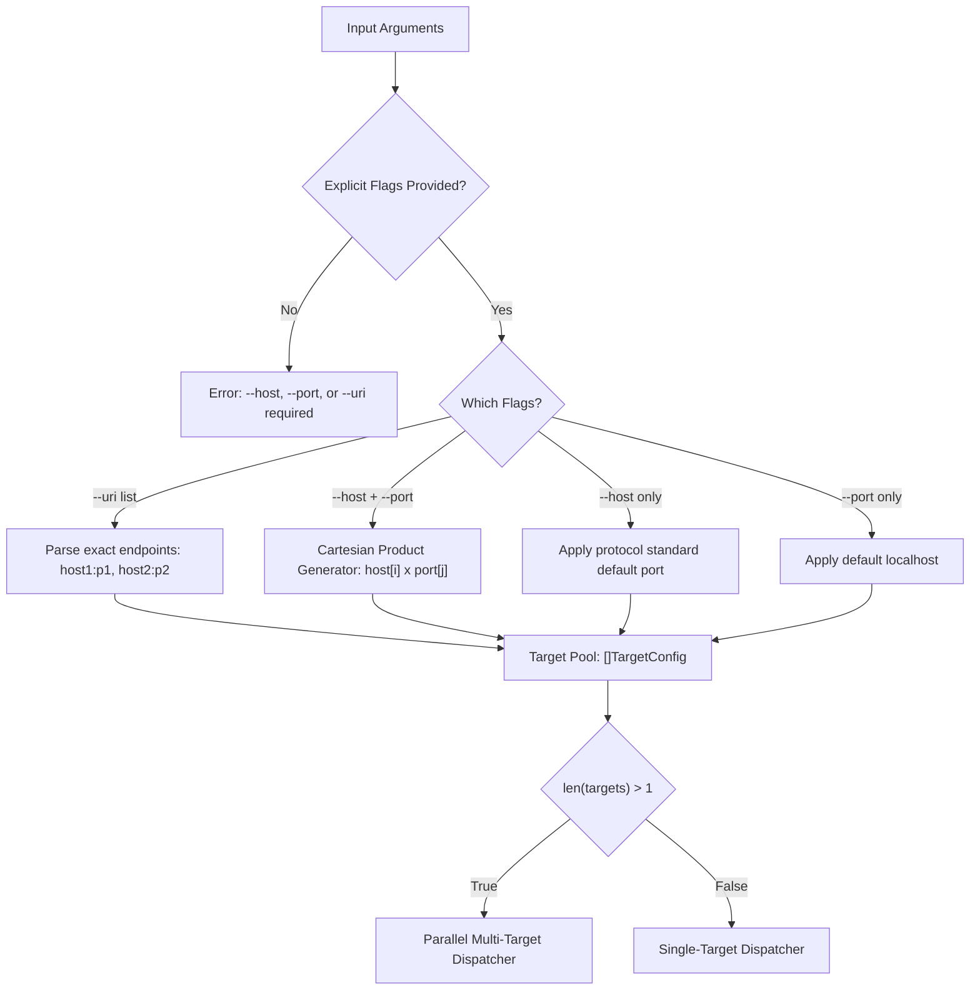
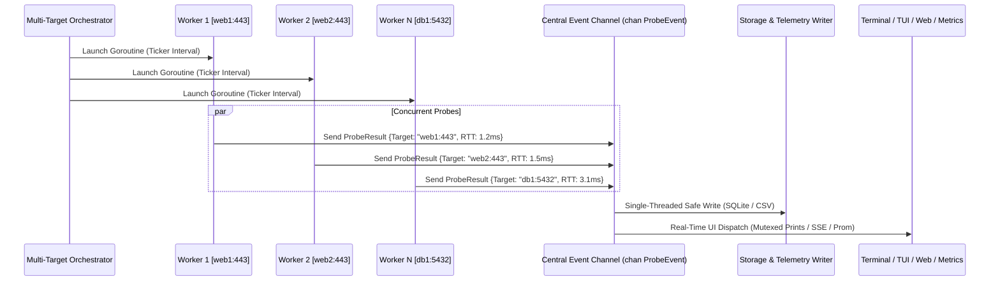

# Netping Parallel Multi-Target & Concurrency Architecture

## 1. Overview & Core Principles

Netping adopts an **explicit, unambiguous target specification model** supporting high-performance concurrent multi-target probing across CLI, TUI dashboard, Web UI, Prometheus metrics, and storage exporters.

### Core Tenets:
1. **Strict Explicit Flags (No Guesswork / No Backward Compatibility):** All targets must be declared via `--host`, `--port`, or `--uri`. Bare positional arguments are rejected.
2. **Parallel-First Execution:** When multiple targets are resolved, Netping initiates parallel worker goroutines with independent pacing and telemetry collection.
3. **Write Safety & Concurrency Guarantees:** Output storage engines (SQLite, CSV, TSV) use a single-writer channel funnel to prevent database lock contention and race conditions.
4. **Unified Visual Identification:** All live probe events across CLI, TUI, and Web UI are tagged with standard `[<host>:<port>]` target identifiers.

---

## 2. Target Specification Matrix



### Syntax & Expansion Rules:

| Mode | Command Syntax | Resolved Target Pool |
| :--- | :--- | :--- |
| **Single Target (Host + Port)** | `netping --host 1.1.1.1 --port 443` | `["1.1.1.1:443 (TCP/HTTPS)"]` |
| **Single Target (URI)** | `netping --uri 1.1.1.1:443` | `["1.1.1.1:443"]` |
| **Multi-Host Sweep** | `netping --host web1,web2,web3 --port 443` | `["web1:443", "web2:443", "web3:443"]` |
| **Multi-Port Sweep** | `netping --host db1 --port 1433,5432,3306` | `["db1:1433", "db1:5432", "db1:3306"]` |
| **Multi-Protocol Sweep (Auto-Port)** | `netping --host srv1 --protocol ssh,mysql,postgresql,hana` | `["srv1:22 (SSH)", "srv1:3306 (MySQL)", "srv1:5432 (Postgres)", "srv1:39013 (HANA)"]` |
| **Multi-Host x Multi-Protocol** | `netping --host srv1,srv2 --protocol http,https,ssh` | `["srv1:80", "srv1:443", "srv1:22", "srv2:80", "srv2:443", "srv2:22"]` |
| **Cartesian Matrix** | `netping --host srv1,srv2 --port 80,443` | `["srv1:80", "srv1:443", "srv2:80", "srv2:443"]` |
| **Heterogeneous Multi-URI** | `netping --uri ssh://srv1:22,mysql://srv1:3306,https://srv2:8443` | `["srv1:22 (SSH)", "srv1:3306 (MySQL)", "srv2:8443 (HTTPS)"]` |
| **Default Protocol Port** | `netping --host db1 --protocol postgresql` | `["db1:5432 (Postgres)"]` |
| **Missing Target Flags** | `netping` | ❌ *Error: `--host`, `--port`, or `--uri` must be specified* |

---

## 3. Parallel Engine Architecture



### Key Execution Details:
- **Worker Isolation:** Each target executes on its own Goroutine with an independent ticker and dedicated `probers.Pinger` instance.
- **Probe Limits (`-c <n>`):** `-c 5` executes 5 probes *per target worker* independently. The orchestrator cleanly waits for all workers to finish before rendering the summary table.
- **Concurrency Control:** `--concurrency <n>` bounds max simultaneous active workers (default: unconstrained / 1 worker per target).
- **Sequential Traceroute:** For `--traceroute`, targets are executed sequentially with distinct visual headers to preserve trace readability.

---

## 4. Terminal, Storage & UI Implications

### A. CLI Terminal Output
- **Real-Time Stream:** Lines are mutex-protected and prepended with target badges:
  ```text
  [web1:443] Reply from 172.30.123.10 on port 443: TCP_conn=1 time=1.24 ms
  [db1:5432] Reply from 172.30.123.20 on port 5432: TCP_conn=1 time=3.15 ms └─ [DIAG] PostgreSQL 16.2
  ```
- **Comparative Fleet Summary Table (on termination):**
  ```text
  ┌─────────────────────────┬────────┬────────┬────────┬────────┬────────┬──────────┐
  │ TARGET                  │ SENT   │ RECV   │ LOSS % │ MIN ms │ AVG ms │ MAX ms   │
  ├─────────────────────────┼────────┼────────┼────────┼────────┼────────┼──────────┤
  │ web1.csysinet.com:443   │ 10     │ 10     │ 0.0%   │ 1.12   │ 1.45   │ 2.01     │
  │ db1.csysinet.com:5432   │ 10     │ 10     │ 0.0%   │ 2.80   │ 3.10   │ 4.22     │
  │ hana.csysinet.com:39013 │ 10     │ 10     │ 0.0%   │ 14.20  │ 15.60  │ 18.90    │
  └─────────────────────────┴────────┴────────┴────────┴────────┴────────┴──────────┘
  ```

### B. Storage & Export Engines
- **SQLite Single-Writer Pipeline:** All probe results funnel through a buffered Go channel consumed by a dedicated database writer routine, eliminating SQLite `database is locked` concurrency errors.
- **Structured Fields:** CSV, TSV, JSON, NDJSON, and SQLite tables include dedicated `target_host`, `target_port`, and `target_uri` columns.

### C. TUI Interactive Dashboard (`--dashboard`)
- **Split Multi-Target Layout:**
  - **Upper Matrix View:** Live tabular grid of all monitored targets showing real-time RTT, loss %, jitter, and health status indicators.
  - **Lower Inspector Pane:** Detailed latency sparkline, TLS certificate dissection, and protocol handshake diagnostics for the selected target (navigated via `▲` / `▼` arrow keys).

### D. Web Dashboard (`--web`)
- **Fleet Summary Bar:** Top-level metrics (`Total Targets`, `Healthy`, `Degraded`, `Fleet Avg RTT`).
- **Synchronized Multi-Series Chart:** Interactive multi-color timeline plotting all targets on a shared time axis with toggleable legend chips.
- **Responsive Target Cards:** Live gauges, sparklines, and status badges (`UP` emerald green, `SLA WARN` amber, `DOWN` crimson).
- **In-Memory Ring Buffers:** Stores the last 100 probe points per target so new browser tabs render immediate historical curves upon connection.
- **Optimized SSE Streaming:** Batch-rendered via `requestAnimationFrame` to maintain smooth 60 FPS performance even under high probe frequencies.

### E. Prometheus Metrics Exporter (`--metrics-addr`)
- Exposes standardized multi-dimensional labels:
  - `netping_rtt_seconds{target="web1:443", host="web1", port="443"}`
  - `netping_probe_total{target="web1:443", status="success"}`
  - `netping_packet_loss_ratio{target="web1:443"}`

---

## 5. Implementation Roadmap

1. **`internal/config`**:
   - Register `--host`, `--port`, `--uri`, and `--concurrency`.
   - Implement Cartesian target resolver and enforce mandatory target flag validation.
2. **`cmd/netping.go` & `pkg/probers`**:
   - Implement multi-target worker orchestration and result channel aggregation.
3. **`internal/printers`**:
   - Implement target badge prefixes and comparative summary table printer.
4. **`pkg/web` & `pkg/metrics`**:
   - Upgrade REST payload (`/api/stats`), SSE broadcaster, and multi-series chart frontend.
5. **Testing Suite**:
   - Comprehensive unit tests in `internal/config` for all target combinations.
   - Live parallel integration tests in `tests/integration/integration_test.go`.

---

## 6. Multi-Protocol Service Auditing Specification

### A. Auto-Port Multi-Service Audit
When multiple protocols are passed via `--protocol proto1,proto2,...` without `--port`, Netping automatically maps each protocol to its standard default port:

```bash
# Probes 4 distinct services on the same host in parallel
netping --host cs-main-wsl001.csysinet.com --protocol ssh,mysql,postgresql,hana
```

**Generated Prober Pool:**
1. `cs-main-wsl001.csysinet.com:22` $\rightarrow$ Protocol: `SSH`
2. `cs-main-wsl001.csysinet.com:3306` $\rightarrow$ Protocol: `MySQL`
3. `cs-main-wsl001.csysinet.com:5432` $\rightarrow$ Protocol: `PostgreSQL`
4. `cs-main-wsl001.csysinet.com:39013` $\rightarrow$ Protocol: `SAP HANA`

---

### B. Fleet-Wide Multi-Protocol Audits
Cross-product of multiple hosts and multiple protocols:

```bash
netping --host srv1,srv2 --protocol http,https,ssh
```

**Generated Prober Pool:**
- `srv1:80` (HTTP), `srv1:443` (HTTPS), `srv1:22` (SSH)
- `srv2:80` (HTTP), `srv2:443` (HTTPS), `srv2:22` (SSH)

---

### C. Scheme-Prefixed URIs (`--uri`)
Explicit protocol binding per endpoint without ambiguity:

```bash
netping --uri ssh://srv1:22,mysql://srv1:3306,https://api.srv2.com:8443
```

---

### D. Multi-Protocol Terminal & Summary Layouts

**Real-Time Terminal Output:**
```text
[cs-main:22 (SSH)]        Reply from 172.30.123.26: TCP_conn=1 time=1.12 ms └─ [DIAG] HostKeys: ssh-ed25519
[cs-main:3306 (MySQL)]    Reply from 172.30.123.26: TCP_conn=1 time=1.45 ms └─ [DIAG] Version: 8.4.0
[cs-main:5432 (Postgres)] Reply from 172.30.123.26: TCP_conn=1 time=2.10 ms └─ [DIAG] PostgreSQL 16.2
[cs-main:39013 (HANA)]    Reply from 172.30.123.26: TCP_conn=1 time=15.6 ms └─ [DIAG] SAP HANA 2.0 SQL
```

**Comparative Summary Table:**
```text
┌─────────────────────────┬────────────┬────────┬────────┬────────┬────────┬────────┬──────────┐
│ TARGET                  │ PROTOCOL   │ SENT   │ RECV   │ LOSS % │ MIN ms │ AVG ms │ MAX ms   │
├─────────────────────────┼────────────┼────────┼────────┼────────┼────────┼────────┼──────────┤
│ cs-main-wsl001:22       │ SSH        │ 10     │ 10     │ 0.0%   │ 0.95   │ 1.12   │ 1.50     │
│ cs-main-wsl001:3306     │ MySQL      │ 10     │ 10     │ 0.0%   │ 1.20   │ 1.45   │ 2.01     │
│ cs-main-wsl001:5432     │ PostgreSQL │ 10     │ 10     │ 0.0%   │ 1.80   │ 2.10   │ 2.95     │
│ cs-main-wsl001:39013    │ SAP HANA   │ 10     │ 10     │ 0.0%   │ 14.20  │ 15.60  │ 18.90    │
└─────────────────────────┴────────────┴────────┴────────┴────────┴────────┴────────┴──────────┘
```

