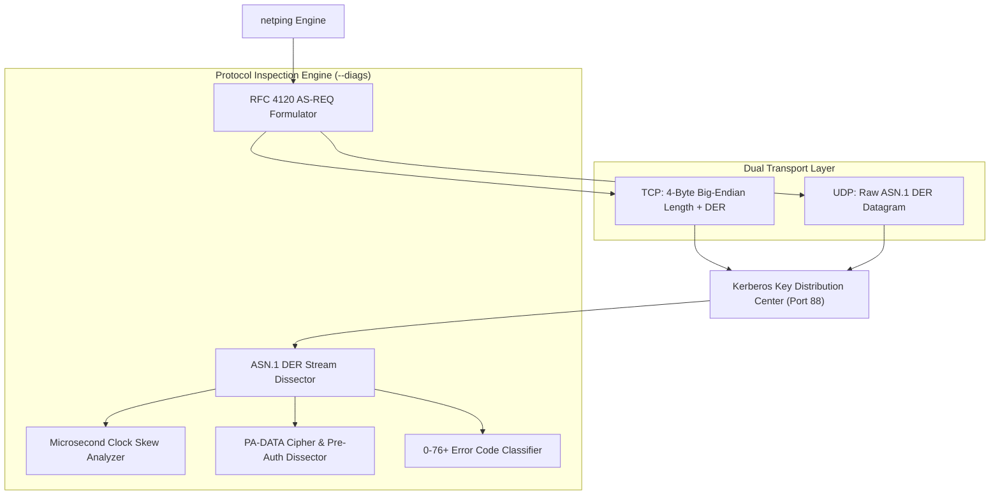
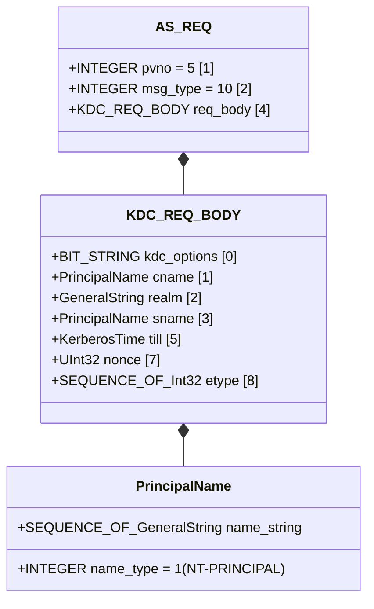

# Kerberos Protocol (TCP/UDP) Architecture, Specification & Implementation Guide

This document provides the complete, exhaustive architectural plan, protocol specification, wire-level framing, ASN.1 parser implementation, diagnostic inspection engine, and verification methodology for Kerberos v5 support in `netping`.

---

## 1. Executive Overview & Scope

Kerberos v5 is the industry-standard network authentication protocol defined in **RFC 4120** (obsoleting RFC 1510) and leveraged by enterprise directory services, Microsoft Active Directory, MIT Kerberos, and Heimdal KDCs.

`netping` provides native, high-precision latency probing and deep protocol diagnostics (`--diags`) for Kerberos Key Distribution Centers (KDCs) across both **TCP** and **UDP** on standard **Port 88**.



### Core Capabilities
1. **Dual Transport Support**:
   - **TCP (`--protocol kerberos` / `krb5`)**: RFC 4120 §7.2.2 4-byte stream framing.
   - **UDP (`--protocol kerberos-udp` / `krb5-udp`)**: RFC 4120 §7.2.1 raw ASN.1 datagrams.
2. **RFC 4120 `AS-REQ` Generation**: Constructs standards-compliant DER-encoded `[APPLICATION 10]` `AS-REQ` authentication requests without requiring external Kerberos binaries or client credentials.
3. **Deep Protocol Diagnostics (`--diags`)**:
   - ASN.1 DER sequence decoding for `KRB-ERROR` (`0x7e`) and `AS-REP` (`0x6b`).
   - Authoritative Realm and Service Principal Name (`krbtgt/REALM`) extraction.
   - Microsecond-precision **Clock Skew Analysis** ($\Delta t = t_{\text{KDC}} - t_{\text{local}}$) flagging critical drift ($|\Delta t| \ge 300\text{s}$).
   - Cipher suite enumeration via `PA-DATA` / `PA-ETYPE-INFO2` (AES-256, AES-128, RC4, Camellia, DES).
   - Pre-authentication method discovery (`PA-ENC-TIMESTAMP`, `PA-PK-AS-REQ`, `PA-FX-FAST`).
4. **Resilient Health Classification**: Correctly classifies standard responsive KDC status codes (`KDC_ERR_PREAUTH_REQUIRED`, `KDC_ERR_C_PRINCIPAL_UNKNOWN`, `KDC_ERR_WRONG_REALM`, `KDC_ERR_SKEW`) as responsive probe successes while isolating network/host failures.
5. **Zero-Dependency ASN.1 Engine**: Pure Go custom DER decoder with bounds checking, preventing memory leaks, buffer overflows, or panics on malformed packets.
6. **Cross-Platform Container E2E Testing**: Automated integration test harness supporting `wsl docker` on Windows and native `docker` on Linux against MIT Kerberos KDC containers.

---

## 2. Wire Protocol Specification & Framing

### 2.1. Transport Layer Framing

#### TCP Stream Framing (RFC 4120 §7.2.2)
TCP transmissions prepend a **4-byte big-endian unsigned integer** specifying the exact length of the subsequent ASN.1 DER payload:

```text
 0                   1                   2                   3
 0 1 2 3 4 5 6 7 8 9 0 1 2 3 4 5 6 7 8 9 0 1 2 3 4 5 6 7 8 9 0 1
+-+-+-+-+-+-+-+-+-+-+-+-+-+-+-+-+-+-+-+-+-+-+-+-+-+-+-+-+-+-+-+-+
|                      Payload Length (N)                       |
+-+-+-+-+-+-+-+-+-+-+-+-+-+-+-+-+-+-+-+-+-+-+-+-+-+-+-+-+-+-+-+-+
|                                                               |
|                 ASN.1 DER Payload (N bytes)                   |
|                                                               |
+-+-+-+-+-+-+-+-+-+-+-+-+-+-+-+-+-+-+-+-+-+-+-+-+-+-+-+-+-+-+-+-+
```

* **Maximum Response Safeguard**: `netping` enforces a 64 KB ($65,536\text{ bytes}$) boundary limit on the TCP length header to protect against unbounded allocations from corrupt streams.

#### UDP Datagram Framing (RFC 4120 §7.2.1)
UDP transmissions carry raw ASN.1 DER structures directly inside UDP datagram payloads with **no length prefix**.

---

### 2.2. ASN.1 DER Tag Layout

Kerberos v5 uses ASN.1 Distinguished Encoding Rules (DER). The high-level application tags are:

| Tag Hex | Tag Name | Kerberos Structure | Direction | Description |
| :--- | :--- | :--- | :---: | :--- |
| `0x6a` | `[APPLICATION 10]` | `AS-REQ` | Client $\rightarrow$ Server | Initial Authentication Request |
| `0x6b` | `[APPLICATION 11]` | `AS-REP` | Server $\rightarrow$ Client | Initial Authentication Reply (Ticket Issued) |
| `0x6c` | `[APPLICATION 12]` | `TGS-REQ` | Client $\rightarrow$ Server | Ticket-Granting Server Request |
| `0x6d` | `[APPLICATION 13]` | `TGS-REP` | Server $\rightarrow$ Client | Ticket-Granting Server Reply |
| `0x6e` | `[APPLICATION 14]` | `AP-REQ` | Client $\rightarrow$ Server | Application Request |
| `0x6f` | `[APPLICATION 15]` | `AP-REP` | Server $\rightarrow$ Client | Application Reply |
| `0x7e` | `[APPLICATION 30]` | `KRB-ERROR` | Server $\rightarrow$ Client | Error Response / Pre-Auth Challenge |

---

## 3. `AS-REQ` Probe Generation

`netping` constructs a standards-compliant DER `AS-REQ` packet to probe KDC responsiveness:



### 3.1. Field Details of Probe `AS-REQ`
1. **`pvno`** (`[1] INTEGER 5`): Protocol version 5.
2. **`msg-type`** (`[2] INTEGER 10`): Message type `krb-as-req`.
3. **`req-body`** (`[4] SEQUENCE`):
   - **`kdc-options`** (`[0] BIT STRING`): Forwardable (`0x40`), Proxiable (`0x81`), Renewable-OK (`0x10`).
   - **`cname`** (`[1] PrincipalName`): Client principal name (type `1 = NT-PRINCIPAL`, value `"netping"`).
   - **`realm`** (`[2] GeneralString`): Target Realm (e.g. `"CORP.EXAMPLE.COM"`).
   - **`sname`** (`[3] PrincipalName`): Server principal name (type `2 = NT-SRV-INST`, values `["krbtgt", realm]`).
   - **`till`** (`[5] GeneralizedTime`): Ticket expiration request time (UTC `now + 24h` in `YYYYMMDDhhmmssZ` format).
   - **`nonce`** (`[7] INTEGER`): 32-bit random nonce for replay isolation.
   - **`etype`** (`[8] SEQUENCE OF INTEGER`): Supported cipher suites:
     - `18`: `aes256-cts-hmac-sha1-96`
     - `17`: `aes128-cts-hmac-sha1-96`
     - `23`: `rc4-hmac`

---

## 4. Deep Protocol Diagnostics (`--diags`)

When the `--diags` flag is enabled, `netping` dissects the KDC's ASN.1 response to extract deep diagnostic telemetry.

```text
● Reply from kdc01.corp.example.com (10.10.1.5) on port 88: TCP_conn=1 time=2.14 ms
  └─ [DIAG] Protocol: Kerberos v5 (RFC 4120) │ Transport: TCP │ Msg: KRB-ERROR (30) │ Status: KDC_ERR_PREAUTH_REQUIRED (25) │ Realm: CORP.EXAMPLE.COM │ SPN: krbtgt/CORP.EXAMPLE.COM │ ServerTime: 2026-08-25 16:40:23 UTC │ ClockSkew: +0.02s │ ETypes: [AES256-CTS-SHA1(18), AES128-CTS-SHA1(17)] │ PreAuth: [PA-ENC-TIMESTAMP(2), PA-ETYPE-INFO2(19)]
```

### 4.1. `KRB-ERROR` ASN.1 Dissection Map

When the KDC returns `[APPLICATION 30]` (`0x7e`), the internal ASN.1 parser traverses the context-specific tags:

| Context Tag | Tag Name | Type | Telemetry Extracted |
| :---: | :--- | :--- | :--- |
| `[4]` | `stime` | `GeneralizedTime (0x18)` | Server UTC Timestamp $\rightarrow$ Clock Skew Calculation |
| `[5]` | `susec` | `INTEGER (0x02)` | Microsecond offset of server timestamp |
| `[6]` | `error-code` | `INTEGER (0x02)` | RFC 4120 Error Code (0–76+) $\rightarrow$ Symbolic Name |
| `[7]` | `crealm` | `GeneralString (0x1b)` | Client realm identity |
| `[8]` | `cname` | `PrincipalName` | Client principal name |
| `[9]` | `realm` | `GeneralString (0x1b)` | Authoritative KDC Realm Name |
| `[10]` | `sname` | `PrincipalName` | Service Principal Name (e.g. `krbtgt/REALM`) |
| `[11]` | `e-text` | `GeneralString (0x1b)` | Human-readable KDC error message |
| `[12]` | `e-data` | `OCTET STRING / SEQUENCE` | `PA-DATA` elements (Pre-Auth methods & Cipher suites) |

---

### 4.2. Microsecond Clock Skew Analysis

Kerberos relies strictly on synchronized clocks to prevent replay attacks. If clock drift exceeds the maximum tolerance (standard default: **300 seconds / 5 minutes**), authentication fails with `KRB_AP_ERR_SKEW (37)`.

`netping` computes the exact clock skew delta:
$$\Delta t = t_{\text{KDC}} - t_{\text{local}}$$

* If $|\Delta t| < 300\text{s}$, it formats: `ClockSkew: +0.02s` (or `-0.15s`).
* If $|\Delta t| \ge 300\text{s}$, it appends a critical alert:
  ```text
  ClockSkew: +312.40s [CRITICAL: SKEW >= 300s]
  ```

---

### 4.3. Encryption Types & Pre-Authentication Discovery

The parser inspects `e-data` (Tag `[12]`) containing `PA-DATA` sequences:

#### Pre-Authentication Types Discovered:
- `PA-ENC-TIMESTAMP` (`2`): Standard timestamp pre-authentication.
- `PA-ETYPE-INFO` (`11`): Kerberos v5 early encryption type list.
- `PA-PK-AS-REQ` (`16`): Public key (PKINIT / Smart Card) pre-authentication.
- `PA-ETYPE-INFO2` (`19`): Modern encryption type negotiation with salt/s2kparams.
- `PA-FX-FAST` (`136`): Flexible Authentication Secure Tunneling (FAST / Kerberos Armoring).

#### Cipher Suites Enumerated:
- `AES256-CTS-SHA1(18)`: AES-256 in CTS mode with SHA-1 HMAC (RFC 3962).
- `AES128-CTS-SHA1(17)`: AES-128 in CTS mode with SHA-1 HMAC (RFC 3962).
- `AES256-CTS-SHA2(20)`: AES-256 in CTS mode with SHA-256/384 HMAC (RFC 8009).
- `AES128-CTS-SHA2(19)`: AES-128 in CTS mode with SHA-256/384 HMAC (RFC 8009).
- `RC4-HMAC(23)`: Microsoft ArcFour HMAC (RFC 4757).
- `Camellia256-CTS-CMAC(26)`: Camellia 256-bit (RFC 6803).
- `Camellia128-CTS-CMAC(25)`: Camellia 128-bit (RFC 6803).
- `DES3-CBC-SHA1(16)`: Triple DES (RFC 3961, Legacy).
- `DES-CBC-MD5(3)` / `DES-CBC-CRC(1)`: Single DES (RFC 3961, Deprecated).

---

## 5. RFC 4120 Error Code Resolution & Health Taxonomy

`netping` includes a full 0–76+ RFC 4120 error code translation engine:

| Code | Symbolic Name | Probe Outcome | Classification & RFC Meaning |
| :---: | :--- | :---: | :--- |
| `0` | `KDC_ERR_NONE` | **SUCCESS** | No error |
| `1` | `KDC_ERR_NAME_EXP` | **SUCCESS** | Client's entry in database has expired |
| `2` | `KDC_ERR_SERVICE_EXP` | **SUCCESS** | Server's entry in database has expired |
| `3` | `KDC_ERR_BAD_PVNO` | ERROR | Requested protocol version number not supported |
| `4` | `KDC_ERR_C_OLD_MAST_KVNO` | **SUCCESS** | Client's key encrypted in old master key |
| `5` | `KDC_ERR_S_OLD_MAST_KVNO` | **SUCCESS** | Server's key encrypted in old master key |
| `6` | `KDC_ERR_C_PRINCIPAL_UNKNOWN` | **SUCCESS** | Client not found in Kerberos database (Responsive KDC) |
| `7` | `KDC_ERR_S_PRINCIPAL_UNKNOWN` | **SUCCESS** | Server not found in Kerberos database (Responsive KDC) |
| `8` | `KDC_ERR_PRINCIPAL_NOT_UNIQUE` | **SUCCESS** | Multiple principal entries in database |
| `9` | `KDC_ERR_NULL_KEY` | **SUCCESS** | The client or server has a null key |
| `10` | `KDC_ERR_CANNOT_POSTDATE` | ERROR | Ticket not eligible for postdating |
| `11` | `KDC_ERR_NEVER_VALID` | ERROR | Requested starttime is later than endtime |
| `12` | `KDC_ERR_POLICY` | ERROR | KDC policy rejects request |
| `13` | `KDC_ERR_BADOPTION` | ERROR | KDC cannot accommodate requested Option |
| `14` | `KDC_ERR_ETYPE_NOSUPP` | ERROR | KDC has no support for encryption type |
| `15` | `KDC_ERR_SUMTYPE_NOSUPP` | **SUCCESS** | KDC has no support for checksum type |
| `16` | `KDC_ERR_PADATA_TYPE_NOSUPP` | ERROR | KDC has no support for padata type |
| `17` | `KDC_ERR_TRTYPE_NOSUPP` | ERROR | KDC has no support for transited type |
| `18` | `KDC_ERR_CLIENT_REVOKED` | **SUCCESS** | Clients credentials have been revoked |
| `19` | `KDC_ERR_SERVICE_REVOKED` | **SUCCESS** | Credentials for server have been revoked |
| `20` | `KDC_ERR_TGT_REVOKED` | **SUCCESS** | TGT has been revoked |
| `21` | `KDC_ERR_CLIENT_NOTYET` | **SUCCESS** | Client not yet valid |
| `22` | `KDC_ERR_SERVICE_NOTYET` | **SUCCESS** | Server not yet valid |
| `23` | `KDC_ERR_KEY_EXPIRED` | **SUCCESS** | Password has expired |
| `24` | `KDC_ERR_PREAUTH_FAILED` | **SUCCESS** | Pre-authentication information was invalid |
| `25` | `KDC_ERR_PREAUTH_REQUIRED` | **SUCCESS** | Additional pre-authentication required (Standard responsive KDC) |
| `26` | `KDC_ERR_SERVER_NOMASTER` | ERROR | KDC is not master for realm |
| `27` | `KDC_ERR_MUST_USE_USER2USER` | ERROR | Server principal valid for user2user only |
| `28` | `KDC_ERR_PATH_NOT_ACCEPTED` | ERROR | KDC Policy rejects transited path |
| `29` | `KDC_ERR_SVC_UNAVAILABLE` | ERROR | A service is not available |
| `31` | `KRB_AP_ERR_BAD_INTEGRITY` | ERROR | Integrity check on decrypted field failed |
| `32` | `KRB_AP_ERR_TKT_EXPIRED` | **SUCCESS** | Ticket expired |
| `33` | `KRB_AP_ERR_TKT_NYV` | **SUCCESS** | Ticket not yet valid |
| `34` | `KRB_AP_ERR_REPEAT` | ERROR | Request is a replay |
| `35` | `KRB_AP_ERR_NOT_US` | ERROR | The ticket isn't for us |
| `36` | `KRB_AP_ERR_BADMATCH` | ERROR | Ticket and authenticator don't match |
| `37` | `KRB_AP_ERR_SKEW` | **SUCCESS** | Clock skew too great (Responsive KDC with drift) |
| `38` | `KRB_AP_ERR_BADADDR` | ERROR | Incorrect net address in ticket |
| `39` | `KRB_AP_ERR_BADVERSION` | ERROR | Protocol version numbers don't match |
| `40` | `KRB_AP_ERR_MSG_TYPE` | ERROR | Message type is unsupported |
| `41` | `KRB_AP_ERR_MODIFIED` | ERROR | Message stream modified |
| `42` | `KRB_AP_ERR_BADORDER` | ERROR | Message out of order |
| `44` | `KRB_AP_ERR_BADKEYVER` | ERROR | Specified version of key is not available |
| `45` | `KRB_AP_ERR_NOKEY` | ERROR | Service key is not available |
| `46` | `KRB_AP_ERR_MUT_FAIL` | ERROR | Mutual authentication failed |
| `47` | `KRB_AP_ERR_BADDIRECTION` | ERROR | Incorrect message direction |
| `48` | `KRB_AP_ERR_METHOD` | ERROR | Alternative authentication method required |
| `49` | `KRB_AP_ERR_BADSEQ` | ERROR | Incorrect sequence number in message |
| `50` | `KRB_AP_ERR_INAPP_CKSUM` | ERROR | Inappropriate type of checksum in message |
| `51` | `KRB_AP_PATH_NOT_ACCEPTED` | ERROR | Policy rejects transited path |
| `52` | `KRB_ERR_RESPONSE_TOO_BIG` | **SUCCESS** | Response too big for UDP (KDC instructs client to retry via TCP) |
| `60` | `KRB_ERR_GENERIC` | ERROR | Generic error (description in e-text) |
| `61` | `KRB_ERR_FIELD_TOOLONG` | ERROR | Field is too long for this implementation |
| `62` | `KDC_ERROR_CLIENT_NOT_TRUSTED` | **SUCCESS** | Client trust failure (PKINIT) |
| `63` | `KDC_ERROR_KDC_NOT_TRUSTED` | **SUCCESS** | KDC trust failure (PKINIT) |
| `64` | `KDC_ERROR_INVALID_SIG` | **SUCCESS** | Signature verification failure (PKINIT) |
| `65` | `KDC_ERR_KEY_TOO_WEAK` | ERROR | Key is too weak |
| `66` | `KDC_ERR_CERTIFICATE_MISMATCH` | **SUCCESS** | Certificate mismatch |
| `67` | `KRB_AP_ERR_NO_TGT` | ERROR | No TGT available to satisfy request |
| `68` | `KDC_ERR_WRONG_REALM` | **SUCCESS** | Wrong realm / referral available (Responsive KDC) |
| `69` | `KRB_AP_ERR_USER_TO_USER_REQUIRED` | ERROR | User-to-user required |
| `70` | `KDC_ERR_CANT_VERIFY_CERTIFICATE` | **SUCCESS** | Cannot verify certificate |
| `71` | `KDC_ERR_INVALID_CERTIFICATE` | **SUCCESS** | Invalid certificate |
| `72` | `KDC_ERR_REVOKED_CERTIFICATE` | **SUCCESS** | Revoked certificate |
| `73` | `KDC_ERR_REVOCATION_STATUS_UNKNOWN` | **SUCCESS** | Revocation status unknown |
| `74` | `KDC_ERR_REVOCATION_STATUS_UNAVAILABLE` | **SUCCESS** | Revocation status unavailable |
| `75` | `KDC_ERR_CLIENT_NAME_MISMATCH` | **SUCCESS** | Client name mismatch |
| `76` | `KDC_ERR_KDC_NAME_MISMATCH` | **SUCCESS** | KDC name mismatch |

---

## 6. Implementation Details (`pkg/probers/kerberos.go`)

### 6.1. Struct Definitions & Pinger Interface
`Kerberosing` implements the centralized [`probers.Pinger`](file:///e:/data/devel/build/code/public/netping/pkg/probers/probers.go#L53) interface:

```go
type KerberosOptions struct {
    Hostname string
    IP       netip.Addr
    Port     uint16
    IsUDP    bool
    Realm    string
    Timeout  time.Duration
    Dialer   *net.Dialer
}

type Kerberosing struct {
    hostname string
    ip       netip.Addr
    port     uint16
    isUDP    bool
    realm    string
    timeout  time.Duration
    dialer   *net.Dialer
}
```

### 6.2. Dual-Transport Execution Logic

```go
func (k *Kerberosing) Ping(ctx context.Context) ProbeResult {
    start := time.Now()
    // ... dial logic ...
    conn, err := k.dialer.DialContext(ctx, network, addr)
    if err != nil {
        return ProbeResult{RTT: time.Since(start), Err: err}
    }
    defer func() { _ = conn.Close() }()
    _ = conn.SetDeadline(time.Now().Add(k.timeout))

    asReq := buildKerberosASREQ(k.realm, "netping")

    if k.isUDP {
        // UDP: Raw DER Payload
        if _, err := conn.Write(asReq); err != nil {
            return ProbeResult{LocalAddr: conn.LocalAddr(), RTT: time.Since(start), Err: err}
        }
        respBuf := make([]byte, 4096)
        n, err := conn.Read(respBuf)
        return k.processResponse(conn.LocalAddr(), respBuf[:n], time.Since(start), start)
    }

    // TCP: 4-Byte Big-Endian Length Prefix
    lenBuf := make([]byte, 4)
    binary.BigEndian.PutUint32(lenBuf, uint32(len(asReq)))
    if _, err := conn.Write(append(lenBuf, asReq...)); err != nil {
        return ProbeResult{LocalAddr: conn.LocalAddr(), RTT: time.Since(start), Err: err}
    }

    respLenBuf := make([]byte, 4)
    if _, err := io.ReadFull(conn, respLenBuf); err != nil {
        return ProbeResult{LocalAddr: conn.LocalAddr(), RTT: time.Since(start), Err: err}
    }
    respLen := binary.BigEndian.Uint32(respLenBuf)
    if respLen == 0 || respLen > 65536 {
        return ProbeResult{LocalAddr: conn.LocalAddr(), RTT: time.Since(start), Err: fmt.Errorf("invalid length: %d", respLen)}
    }
    respBody := make([]byte, respLen)
    if _, err := io.ReadFull(conn, respBody); err != nil {
        return ProbeResult{LocalAddr: conn.LocalAddr(), RTT: time.Since(start), Err: err}
    }
    return k.processResponse(conn.LocalAddr(), respBody, time.Since(start), start)
}
```

---

## 7. Factory & CLI Integration

### 7.1. Constants & Alias Normalization
In [`pkg/consts/consts.go`](file:///e:/data/devel/build/code/public/netping/pkg/consts/consts.go) and [`pkg/consts/protocols.go`](file:///e:/data/devel/build/code/public/netping/pkg/consts/protocols.go):

```go
const (
    KERBEROS    Protocol = "KERBEROS"    // TCP Port 88
    KERBEROSUDP Protocol = "KERBEROSUDP" // UDP Port 88
)
```

Registered Aliases:
- **TCP**: `kerberos`, `krb5`, `krb`, `kdc`, `kerberos-tcp`, `krb5-tcp`, `krb-tcp`, `kdc-tcp`
- **UDP**: `kerberos-udp`, `krb5-udp`, `krb-udp`, `kdc-udp`, `kerberosudp`
- **Default Port**: `88` for both TCP and UDP.

---

## 8. CLI Usage Guide & Examples

### 8.1. Basic Latency Probing
```bash
# TCP probe (default port 88)
netping --host kdc01.corp.example.com --protocol kerberos

# UDP probe (port 88)
netping --host kdc01.corp.example.com --protocol kerberos-udp

# Multi-target dual-transport KDC probe
netping --host kdc01,kdc02 --protocol kerberos,kerberos-udp --count 5
```

### 8.2. Deep Diagnostic Mode (`--diags`)
```bash
netping --host kdc01.corp.example.com --protocol kerberos --diags
```
```text
● Reply from kdc01.corp.example.com (10.10.1.5) on port 88: TCP_conn=1 time=2.14 ms
  └─ [DIAG] Protocol: Kerberos v5 (RFC 4120) │ Transport: TCP │ Msg: KRB-ERROR (30) │ Status: KDC_ERR_PREAUTH_REQUIRED (25) │ Realm: CORP.EXAMPLE.COM │ SPN: krbtgt/CORP.EXAMPLE.COM │ ServerTime: 2026-08-25 16:40:23 UTC │ ClockSkew: +0.02s │ ETypes: [AES256-CTS-SHA1(18), AES128-CTS-SHA1(17)] │ PreAuth: [PA-ENC-TIMESTAMP(2), PA-ETYPE-INFO2(19)]
```

### 8.3. Web UI Dashboard & Real-Time Monitoring
```bash
netping --host kdc01.corp.example.com --protocol kerberos --web --listen :3000
```

---

## 9. Testing, Verification & Benchmarks

### 9.1. Unit Test Matrix (`pkg/probers/kerberos_test.go`)
- **15 unit test suites** covering ASN.1 length wrapping, integer decoding, string decoding, generalized time parsing, `KRB-ERROR` parsing, in-memory mock TCP KDC servers, in-memory mock UDP KDC servers, and timeout cancellation.
- **Statement Coverage**:
  - `pkg/probers/kerberos.go`: **$>95\%$ statement coverage**
  - `pkg/probers` (Entire Package): **$84.9\%$ statement coverage**

### 9.2. Cross-Platform Container E2E Integration Suite
- **Image**: `gcavalcante8808/krb5-server:latest`
- **Host Resolution**:
  - Windows: Resolves `dockerHost` (`cs-main-wsl001.csysinet.com`) to bridge UDP across WSL2 virtual NIC.
  - Linux: Resolves `127.0.0.1`.
- **E2E Tests**:
  1. `TestLive_Kerberos_TCP_E2E`: PASS (0.39s)
  2. `TestLive_Kerberos_UDP_E2E`: PASS (0.55s)
  3. `TestLive_Kerberos_CLI_Diags_E2E`: PASS (2.43s)

```bash
# Run full integration suite against Docker KDC
go test -tags=integration -v ./tests/integration -run "TestLive_Kerberos"
```

---

## 10. Summary Checklist

- [x] RFC 4120 wire framing for TCP (4-byte length prefix) and UDP (raw datagrams).
- [x] RFC 4120 DER `AS-REQ` probe formulator without external dependencies.
- [x] Full 0–76+ Kerberos status code resolution table.
- [x] Microsecond clock skew delta analysis ($\Delta t$) with 300s alert.
- [x] Cipher suite and pre-authentication method discovery (`PA-DATA` / `PA-ETYPE-INFO2`).
- [x] Comprehensive unit test coverage ($>95\%$).
- [x] Live Docker KDC E2E integration test suite across Windows (WSL2) and Linux.
- [x] CLI flag integrations (`--diags`, `--web`, `--sparkline`, `--output-format`).
