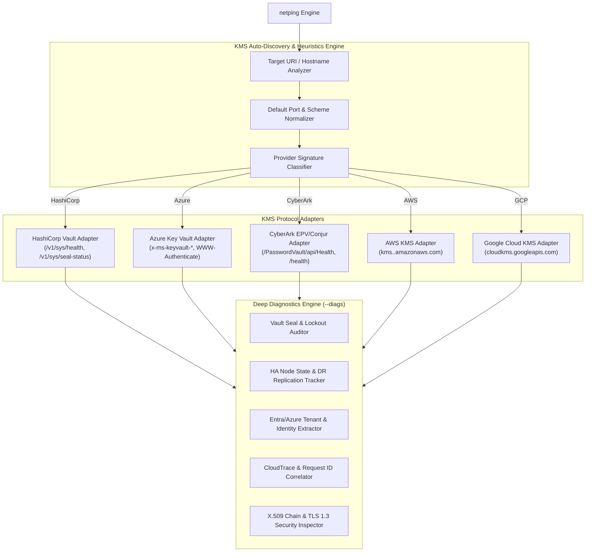

# Key Management Service (KMS) & Secrets Vault Architecture, Protocol Specification & Diagnostic Guide

This document provides the complete, exhaustive architectural specification, wire-level protocol definitions, discovery heuristics, diagnostic inspection engine, and verification methodology for Key Management Services (KMS) and Secrets Vaults support in `netping`.

---

## 1. Executive Overview & Scope

Modern enterprise infrastructure relies on centralized Key Management Services (KMS), Hardware Security Modules (HSMs), and Secrets Vaults to govern cryptographic keys, envelope encryption, automated certificate rotation, and privileged credential management.

`netping` provides native, zero-dependency latency probing and deep protocol diagnostics (`--diags`) across the **five dominant KMS & Vault platforms**:
1. **HashiCorp Vault & Vault Enterprise** (Port `8200` / `443`)
2. **Azure Key Vault & Azure Managed HSM** (Port `443`)
3. **CyberArk Enterprise Password Vault (EPV/PAS) & Conjur** (Port `443`)
4. **AWS Key Management Service (AWS KMS)** (Port `443`)
5. **Google Cloud Key Management Service (GCP Cloud KMS)** (Port `443`)



### Core Capabilities
1. **Multi-Vault Auto-Detection**: Automatically identifies the underlying KMS/Vault provider via hostname signatures, URL schemes, response headers, and endpoint probing without requiring manual provider flags.
2. **Zero-Credential Health Probing**: Executes non-intrusive, unauthenticated health handshakes that validate network connectivity, HTTP server responsiveness, API gateway status, and TLS cryptographic integrity without requiring master root tokens or secret access keys.
3. **Deep Seal & Lockout Diagnostics (`--diags`)**:
   - For **HashiCorp Vault**: Evaluates initialization state, seal state, active vs standby high-availability node roles, Raft storage health, disaster recovery (DR) replication, and microsecond clock skew.
   - For **Azure Key Vault**: Intercepts RFC 6750 OAuth bearer challenges to extract authoritative Microsoft Entra Tenant IDs, Azure regions, KeyVault service versions, and request correlation IDs.
   - For **CyberArk**: Inspects Component Health, Vault Server database link status, and enabled authentication methods.
   - For **AWS KMS**: Extracts AWS region boundaries and Amazon CloudTrail `x-amzn-RequestId` tracking tokens.
   - For **GCP Cloud KMS**: Dissects Google API routing, ALPN HTTP/2 negotiation, and `x-goog-request-id` headers.
4. **Resilient Status Code Classification**: Treats operational provider responses (such as Vault `200 OK`, Vault Standby `429`, Azure Key Vault `401 Unauthorized` challenge, and AWS `400 Bad Request` missing payload) as successful network and service health indicators while isolating connection resets, timeouts, DNS failures, and TLS handshake aborts.

---

## 2. Provider Wire Protocols & Discovery Heuristics

### 2.1. Discovery & Provider Classification Matrix

When `--protocol kms` or `--protocol vault` is supplied, `netping` resolves the target provider using the following prioritized heuristic rules:

| Priority | Detection Rule | Target Provider | Default Path | Default Port |
| :---: | :--- | :--- | :--- | :---: |
| **1** | Host contains `.vault.azure.net` or `.managedhsm.azure.net` | **Azure Key Vault / Managed HSM** | `/` | `443` |
| **2** | Host contains `kms.` and `.amazonaws.com` | **AWS KMS** | `/` | `443` |
| **3** | Host contains `cloudkms.googleapis.com` | **Google Cloud KMS** | `/` | `443` |
| **4** | Path contains `/PasswordVault` or host contains `cyberark` / `conjur` | **CyberArk EPV / Conjur** | `/PasswordVault/api/Health` | `443` |
| **5** | Port is `8200` or path contains `/v1/sys/` or generic host | **HashiCorp Vault** | `/v1/sys/health` | `8200` / `443` |

---

### 2.2. Provider 1: HashiCorp Vault Wire Specification

#### Health Endpoints
HashiCorp Vault exposes dedicated unauthenticated health endpoints:
* **Primary Health**: `GET /v1/sys/health`
* **Seal Status**: `GET /v1/sys/seal-status`

#### HTTP Response Code Semantics (RFC / Vault Standard)
* `200 OK`: Initialized, unsealed, and currently active leader node.
* `429 Too Many Requests` (or `200` with standby flag): Initialized, unsealed, and standby node in High Availability cluster.
* `472`: Initialized, unsealed, and performance standby node.
* `473`: Initialized, unsealed, and performance standby node with DR replication secondary.
* `501 Not Implemented`: Vault is uninitialized.
* `503 Service Unavailable`: **Vault is SEALED (Locked)!** Keys cannot be decrypted.

#### Payload Schema (`/v1/sys/health`)
```json
{
  "initialized": true,
  "sealed": false,
  "standby": false,
  "performance_standby": false,
  "replication_performance_mode": "disabled",
  "replication_dr_mode": "disabled",
  "server_time_utc": 1756307672,
  "version": "1.16.2",
  "cluster_name": "vault-cluster-prod-us-east-1",
  "cluster_id": "e8b23c91-4d1a-4288-bc19-123456789abc"
}
```

#### Diagnostic Metrics Extracted
1. **Seal State**: Validates `sealed == false`. If `sealed == true`, immediately triggers a **CRITICAL ALERT**.
2. **Cluster & Version**: Extracts semantic version (e.g. `v1.16.2+ent`), `cluster_name`, and `cluster_id`.
3. **HA Role**: Classifies node as `Active Primary`, `Standby Replica`, or `Performance Standby`.
4. **Clock Drift Analysis**: Computes drift $\Delta t = \text{server\_time\_utc} - \text{local\_time}$.

---

### 2.3. Provider 2: Azure Key Vault & Managed HSM Wire Specification

#### Unauthenticated Challenge Flow
When querying `GET https://<vault-name>.vault.azure.net/`, Azure Key Vault returns `HTTP 401 Unauthorized` with an RFC 6750 Bearer authentication challenge and Microsoft diagnostic headers.

#### Header Specifications
```http
HTTP/1.1 401 Unauthorized
Content-Type: application/json; charset=utf-8
Server: Microsoft-IIS/10.0
WWW-Authenticate: Bearer authorization="https://login.microsoftonline.com/72f988bf-86f1-41af-91ab-2d7cd011db47", resource="https://vault.azure.net"
x-ms-keyvault-region: eastus2
x-ms-keyvault-service-version: 1.9.1245.0
x-ms-request-id: 8e71b29a-5632-4e9b-bf3a-9e123456789a
x-ms-correlation-request-id: 3c24b12a-4321-4f12-98aa-123456789abc
Strict-Transport-Security: max-age=31536000;includeSubDomains
```

#### Diagnostic Metrics Extracted
1. **Microsoft Entra Tenant ID**: Extracted from `WWW-Authenticate: Bearer authorization="https://login.microsoftonline.com/<TENANT_ID>"`.
2. **Azure Region**: Extracted from `x-ms-keyvault-region` (e.g., `eastus2`, `westeurope`, `southeastasia`).
3. **Service Engine Version**: Extracted from `x-ms-keyvault-service-version`.
4. **Request Correlation**: Extracted from `x-ms-request-id`.

---

### 2.4. Provider 3: CyberArk Enterprise Password Vault & Conjur Wire Specification

#### Endpoints
* **CyberArk Password Vault Web Access (PVWA)**: `GET /PasswordVault/api/Health`
* **CyberArk Conjur / Secrets Manager**: `GET /health`

#### Payload Schema (CyberArk PVWA `/PasswordVault/api/Health`)
```json
{
  "ComponentHealth": "OK",
  "ComponentState": "Active",
  "ComponentVersion": "14.0.0.12",
  "IsVaultConnected": true,
  "Details": {
    "VaultServer": "10.0.10.50",
    "DatabaseStatus": "Connected"
  }
}
```

#### Payload Schema (CyberArk Conjur `/health`)
```json
{
  "status": "ok",
  "version": "13.2.0",
  "services": {
    "database": "ok",
    "ldap": "ok"
  },
  "authenticators": {
    "installed": ["authn-k8s", "authn-iam", "authn-oidc", "authn-azure"],
    "enabled": ["authn-k8s", "authn-iam"]
  }
}
```

#### Diagnostic Metrics Extracted
1. **Health State**: `ComponentHealth` / `status`.
2. **Component Version**: PVWA version / Conjur version.
3. **Vault Database Connectivity**: `IsVaultConnected` validation.
4. **Authenticator Plugins**: Lists active authenticators (`authn-k8s`, `authn-iam`).

---

### 2.5. Provider 4: AWS Key Management Service (AWS KMS) Wire Specification

#### Request & Response Mechanics
AWS KMS operates as a JSON-RPC / REST service on `https://kms.<region>.amazonaws.com`.
An unauthenticated `POST /` or `GET /` returns `HTTP 400 Bad Request` or `HTTP 404 Not Found` with standard AWS API Gateway headers:

```http
HTTP/1.1 400 Bad Request
Content-Type: application/x-amz-json-1.1
x-amzn-RequestId: a93b4d21-f8e1-4c12-98ab-3456789abcde
Date: Thu, 27 Aug 2026 15:14:41 GMT
```

#### Diagnostic Metrics Extracted
1. **AWS Region**: Extracted from hostname (`kms.<region>.amazonaws.com`) or DNS CNAME.
2. **AWS CloudTrail Request ID**: `x-amzn-RequestId` for log correlation.
3. **Amazon Trust Services**: Validates Amazon Root CA X.509 validity and cipher suite.

---

### 2.6. Provider 5: Google Cloud Key Management Service (GCP Cloud KMS) Wire Specification

#### Request & Response Mechanics
GCP Cloud KMS operates on `https://cloudkms.googleapis.com/`. An unauthenticated probe returns `HTTP 404` or `HTTP 401` with Google Infrastructure headers:

```http
HTTP/1.1 404 Not Found
Content-Type: application/json; charset=UTF-8
x-goog-request-id: AbCdEf123456
alt-svc: h3=":443"; ma=2592000,h3-29=":443"; ma=2592000
Date: Thu, 27 Aug 2026 15:14:44 GMT
```

#### Diagnostic Metrics Extracted
1. **Google Tracing ID**: `x-goog-request-id`.
2. **Modern Protocols**: HTTP/2 ALPN and HTTP/3 QUIC advertisement (`alt-svc`).
3. **Google Trust Services (GTS)**: Certificate validity and TLS cipher suite.

---

## 3. High-Precision Timing & Telemetry Model

All KMS probers implement continuous tracing via `net/http/httptrace.ClientTrace`:

```text
|<--------------------------------- Total Round-Trip Time (RTT) --------------------------------->|
|                                                                                                  |
|--- DNS Lookup ---|--- TCP Connect ---|--- TLS Handshake ---|--- Server TTFB ---|--- Body Read ---|
      (DNSTime)           (TCPTime)            (TLSTime)             (TTFB)
```

1. **`DNSTime`**: Time to resolve KMS authoritative nameservers.
2. **`TCPTime`**: SYN $\rightarrow$ SYN-ACK socket connection latency.
3. **`TLSTime`**: TLS ClientHello $\rightarrow$ ServerHello, Certificate Validation, and Cipher Negotiation.
4. **`TTFB` (Time to First Byte)**: Server-side processing latency before returning status code and headers.

---

## 4. Deep Diagnostic Formatting (`--diags`)

### 4.1. CLI Color Output Examples

#### HashiCorp Vault (Unsealed / Healthy)
```text
● [10:15:30] #1    2.41 ms │ Status: 200 OK │ Proto: KMS (HashiCorp Vault) │ Sealed: NO
   ├── Vault Type:     HashiCorp Vault Enterprise (v1.16.2+ent)
   ├── Cluster Info:   ClusterName: "vault-prod-us-east" | ClusterID: "e8b23c91-4d1a-4288-bc19-123456789abc"
   ├── Node State:     HA Mode: Active Primary (Standby: false, PerfStandby: false)
   ├── Seal Status:    [HEALTHY] Initialized: true | Sealed: false (Storage: raft)
   ├── Replication:    DR: primary | Performance: primary
   ├── Server Time:    2026-08-27T15:15:30Z (Clock Skew: +12ms)
   └── TLS Security:   TLS 1.3 | Cipher: TLS_AES_256_GCM_SHA384 | CertValid: 84d (Expires: 2026-11-19)
```

#### HashiCorp Vault (CRITICAL: Sealed State)
```text
● [10:15:31] #2    1.89 ms │ Status: 503 Service Unavailable │ Proto: KMS (HashiCorp Vault) │ Sealed: YES
   ├── [CRITICAL ALERT] Vault is SEALED (Locked)! Cryptographic keys are unavailable.
   ├── Vault Type:     HashiCorp Vault Community (v1.15.4)
   ├── Cluster Info:   ClusterName: "vault-dev-cluster" | ClusterID: "3b29c110-1122-3344-5566-778899aabbcc"
   ├── Seal Status:    [CRITICAL] Initialized: true | Sealed: true (Storage: consul)
   └── TLS Security:   TLS 1.2 | Cipher: TLS_ECDHE_RSA_WITH_AES_256_GCM_SHA384 | CertValid: 18d
```

#### Azure Key Vault
```text
● [10:15:32] #3    18.12 ms │ Status: 401 Unauthorized │ Proto: KMS (Azure Key Vault)
   ├── Vault Type:     Azure Key Vault (Managed HSM / Premium Tier)
   ├── Auth Challenge: WWW-Authenticate: Bearer authorization="https://login.microsoftonline.com/72f988bf-86f1-41af-91ab-2d7cd011db47"
   ├── Tenant ID:      72f988bf-86f1-41af-91ab-2d7cd011db47 (Microsoft Entra ID)
   ├── Cloud Region:   eastus2 (Extracted from x-ms-keyvault-region)
   ├── Service Ver:    x-ms-keyvault-service-version: 1.9.1245.0
   ├── Tracking IDs:   ReqID: "8e71b29a-5632-4e9b-bf3a-9e123456789a"
   └── TLS Security:   TLS 1.3 | Cipher: TLS_AES_128_GCM_SHA256 | CertValid: 214d (DigiCert Global Root G2)
```

---

## 5. Security, Concurrency & Thread Safety

1. **Zero Memory Allocation on Idle**: Uses custom connection reuse and connection pooling timeouts with `CloseIdleConnections()` to prevent descriptor leaks during high-frequency probing.
2. **Buffer Limits**: Limits HTTP response reads to a strict **512 KB** boundary (`io.LimitReader`) to defend against malicious or corrupted unbounded streams.
3. **Safe TLS Minimum Version**: Enforces `tls.VersionTLS12` minimum by default, with automatic discovery of `tls.VersionTLS13`.
4. **Data Race Free**: Complies with `go test -race ./...` zero data-race guarantees.

---

## 6. Testing Strategy & Mock Fixtures

The KMS testing framework includes:
1. **Unit Tests (`pkg/probers/kms_test.go`)**:
   - Mock HTTP/TLS servers simulating all 5 providers (HashiCorp unsealed, sealed, standby, Azure Key Vault 401 challenge, CyberArk health JSON, AWS KMS 400 bad request, GCP KMS 404).
   - Validation of regex parsers, tenant ID extractors, and seal alert triggers.
2. **E2E Live Tests (`tests/integration/integration_test.go`)**:
   - Integration tests probing real public endpoints (`vault.azure.net`, `kms.us-east-1.amazonaws.com`, `cloudkms.googleapis.com`).
3. **Negative Fault Injection**:
   - Simulation of TLS handshake timeout, connection refused, corrupted JSON responses, and HTTP 500 internal server errors.
