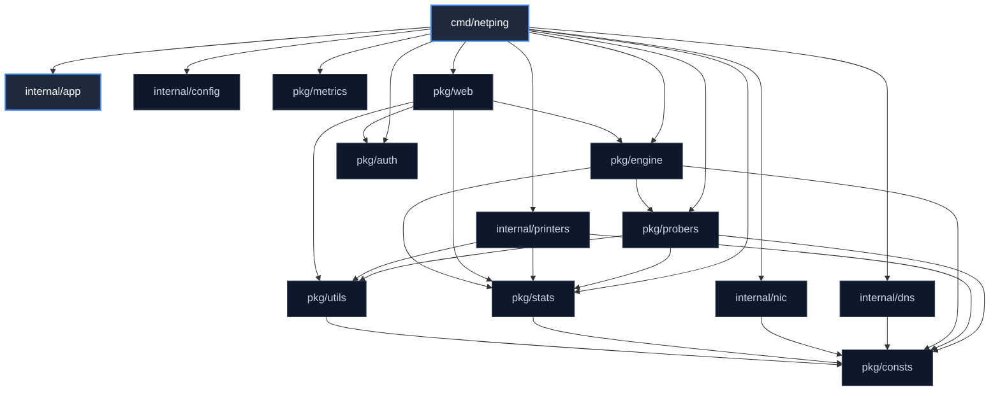
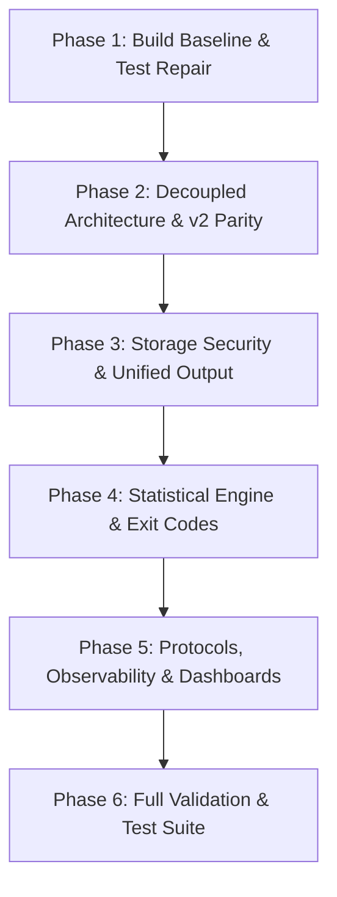

# `netping` (Enhanced `tcping` v3) — Production-Grade Architecture, Modernization & Engineering Specification

---

## 1. Executive Summary & Modernization Overview

This document serves as the complete engineering specification, architectural record, and implementation roadmap for **`netping`** (the new name for the enhanced **`tcping` v3** suite).

The project has evolved from a simple TCP socket ping utility into a **comprehensive, enterprise-grade network and application protocol diagnostics suite**, providing Layer 3 to Layer 7 latency probing, real-time visual telemetry, interactive 120-column terminal and browser web dashboards, continuous SLA threshold monitoring, and deep protocol handshake diagnostics.

---

## 2. Architectural Design & Dependency Review

A rigorous architectural review was performed on the roadmap to guarantee **acyclic package dependencies**, **thread safety**, **idiomatic Go practices**, and **clean separation of concerns**.

### Package Dependency Flow (Strict DAG)



> [!NOTE]
> **Decoupled Architecture Guarantee**:
> In the original v3 codebase, `config` instantiated `dns.Resolver`, `nic.NetworkInterface`, and referenced `printers`, creating circular dependency risks with tests.
> **Refactored Architecture**: `config` is a pure leaf package holding only primitive config structs and CLI parsing logic. The application orchestrator ([`cmd/netping.go`](cmd/netping.go) / `netping`) initializes `dns.Resolver`, `nic.NetworkInterface`, `printers.Printer`, and `probers.Prober`. No internal package imports `config`.

---

## 3. Core Design Patterns & Idiomatic Go Standards

### A. Thread-Safe Immutable Statistics Snapshotting
To eliminate data races permanently without lock contention between high-frequency probe ticks and interactive user summary requests (or Prometheus metric scrapes):
- [`pkg/stats/stats.go`](pkg/stats/stats.go) owns a private mutex protecting internal accumulators.
- It exposes a thread-safe `Snapshot() stats.Snapshot` method returning an immutable deep copy of current metrics.
- All `Printer` implementations consume `stats.Snapshot` by value. Probing writes proceed without blocking output formatting.

```go
type Snapshot struct {
    Target                   string
    IP                       netip.Addr
    Port                     uint16
    Protocol                 consts.Protocol
    StartTime                time.Time
    EndTime                  time.Time
    TotalProbes              uint
    SuccessfulProbes         uint
    UnsuccessfulProbes       uint
    PacketLossPercent        float32
    RTT                      []float32
    RTTMin, RTTAvg, RTTMax   float32
    P50, P90, P95, P99       float32
    StdDev                   float32
    Jitter                   float32
    LastFailureReason        FailureReason
    DNSTime                  time.Duration
    LocalAddr                net.Addr
    TotalUptime              time.Duration
    TotalDowntime            time.Duration
    LongestUp                LongestDuration
    LongestDown              LongestDuration
    HostnameChanges          []HostnameChange
}
```

### B. Interface Minimization & Single Responsibility
- **Eliminate Bloated Getters**: Removed the 16-method getter interface in `stats.Config`.
- **Streamlined `Pinger` Contract**:
  ```go
  type ProbeResult struct {
      LocalAddr     net.Addr
      RTT           time.Duration
      DNSTime       time.Duration
      FailureReason FailureReason
      HTTPStatus    int
      Diagnostics   string
      Err           error
  }

  type Pinger interface {
      Ping(ctx context.Context) ProbeResult
  }
  ```
- **Printer Lifecycle**: Removed `os.Exit` and process management from `Printer`. Storage printers implement standard `io.Closer` (`Close() error`). [`cmd/netping.go`](cmd/netping.go) manages process termination and exit codes.

---

## 4. v2 Feature Parity & Regression Matrix

| Capability | v2 (`tcping-master`) | v3 Pre-Modernization | Specification & Resolution |
| :--- | :--- | :--- | :--- |
| **Dynamic Local IP & Port** (`-show-source-address`) | Captured from active `net.Conn` | Discards connection; panics if `-I` not set | Capture `conn.LocalAddr()` in `ProbeResult` dynamically on every probe. |
| **Guaranteed Storage Flush** | Explicit close in `shutdown()` | Never closes/flushes in `main()` | Enforce `defer printer.Close()` in `main()` via `io.Closer`. |
| **Interactive Stats (`Enter` key)** | Synchronous check in loop | Unsynchronized background goroutine | Protected via `stats.Snapshot()` copy-on-read. |
| **CSV Stats Header** | Written to `StatsWriter` | Written to `ProbeWriter` (corrupted) | Route stats headers to `StatsWriter`. |
| **Explicit Help Flag** | Supported `-h` | Missing explicit registration | Explicitly register and handle `-h` / `--help`. |

---

## 5. Standard Diagnostic Exit Codes

| Exit Code | Identifier | Scenario | Reference |
| :---: | :--- | :--- | :--- |
| **`0`** | `ExitSuccess` | Probing finished with 0% packet loss (all probes succeeded). | [`pkg/consts/exit.go`](pkg/consts/exit.go) |
| **`1`** | `ExitGeneralError` | Unhandled error, panic recovery, or generic runtime failure. | [`pkg/consts/exit.go`](pkg/consts/exit.go) |
| **`2`** | `ExitUsageError` | Invalid CLI arguments, bad port syntax, conflicting flags. | [`pkg/consts/exit.go`](pkg/consts/exit.go) |
| **`3`** | `ExitDNSResolutionFailed` | Failed to resolve target hostname or unreachable custom DNS server. | [`pkg/consts/exit.go`](pkg/consts/exit.go) |
| **`4`** | `ExitNetworkInterfaceError` | Interface not found, no IP assigned, or routing failure. | [`pkg/consts/exit.go`](pkg/consts/exit.go) |
| **`5`** | `ExitTargetUnreachable` | 100% packet loss (target did not respond to any probe). | [`pkg/consts/exit.go`](pkg/consts/exit.go) |
| **`6`** | `ExitPartialPacketLoss` | Probing completed with partial packet loss (>0% and <100%). | [`pkg/consts/exit.go`](pkg/consts/exit.go) |
| **`7`** | `ExitStorageError` | Failed to open, write, or flush CSV or SQLite database files. | [`pkg/consts/exit.go`](pkg/consts/exit.go) |
| **`130`**| `ExitInterrupted` | Terminated by user via SIGINT (`Ctrl+C`) or SIGTERM. | [`pkg/consts/exit.go`](pkg/consts/exit.go) |

---

## 6. Visual Design System & 120-Column Terminal Layout

### Enterprise Color Palette
All user-facing terminal outputs were redesigned with an **enterprise slate palette** ([`internal/printers/color.go`](internal/printers/color.go), [`internal/printers/dashboard.go`](internal/printers/dashboard.go)):

| Element | ANSI Escape | Color Palette |
| :--- | :--- | :--- |
| **Box Borders & Dividers** | `\033[38;5;60m` | Slate Steel Blue (`#5f5f87`) |
| **Active Target / Port / Proto** | `\033[38;5;75m` | Soft Sky Azure (`#5fafff`) |
| **Labels & Descriptions** | `\033[38;5;244m` | Muted Charcoal Gray (`#808080`) |
| **Success Indicators (`●`)** | `\033[38;5;71m` | Soft Sage Emerald (`#5faf5f`) |
| **Failure Indicators (`✖`)** | `\033[38;5;167m` | Muted Coral (`#d75f5f`) |
| **Latency Values & RTT** | `\033[1;37m` | High-Contrast Bold White |
| **Waveform Chart Bars** | `\033[38;5;75m` | Clean Gradient Azure (`█`, `▄`, `.`) |

### 120-Column Interactive TUI Dashboard (`--dashboard`)
Implemented in [`internal/printers/dashboard.go`](internal/printers/dashboard.go):
- **Frame & Border**: Exactly 120 total characters wide (116 inner visible width) with ANSI-safe width clamping.
- **106-Point Waveform History**: 5-tier vertical bar graph displaying the latest 106 latency samples in real time.
- **5-Column Symmetrical KPI Cards**:
  - Row 1: `Probes` (21 cols) │ `Success` (21 cols) │ `Failed` (21 cols) │ `Loss %` (21 cols) │ `Jitter` (20 cols)
  - Row 2: `Min RTT` (21 cols) │ `Avg RTT` (21 cols) │ `Max RTT` (21 cols) │ `P95 SLA` (21 cols) │ `P99 SLA` (20 cols)
- **Live Diagnostics Row**: Dedicated status banner rendering live protocol negotiation metadata on every probe.
- **Recent Probe Event Log**: Scrolling event stream showing sequence number, RTT, and handshake details.

---

## 7. Multi-Protocol Engine Matrix (15+ Protocols)

| Protocol Flag | Default Port | Source Implementation | Description |
| :--- | :---: | :--- | :--- |
| `--protocol tcp` | — | [`pkg/probers/tcp.go`](pkg/probers/tcp.go) | Standard TCP 3-way handshake with dynamic source port capture. |
| `--protocol http` | 80 | [`pkg/probers/http.go`](pkg/probers/http.go) | HTTP/1.1 and HTTP/2 requests with TTFB latency breakdown. |
| `--protocol https` | 443 | [`pkg/probers/http.go`](pkg/probers/http.go) | HTTPS probing with TLS handshake, cert validation, and TTFB. |
| `--protocol tls` / `tcps` / `ssl` | 443 | [`pkg/probers/raw_tls.go`](pkg/probers/raw_tls.go) | Raw TLS 1.2/1.3 handshake timing and X.509 cert extraction. |
| `--protocol udp` | — | [`pkg/probers/udp.go`](pkg/probers/udp.go) | Generic UDP datagram transmission and response tracking. |
| `--protocol icmp` | — | [`pkg/probers/icmp.go`](pkg/probers/icmp.go) | Layer-3 ICMP Echo Ping (IPv4/IPv6) with unprivileged fallback. |
| `--protocol ws` / `wss` | 80 / 443 | [`pkg/probers/ws.go`](pkg/probers/ws.go) | RFC 6455 WebSocket Upgrade and Ping/Pong frame latency. |
| `--protocol grpc` / `grpcs` | 50051 / 443 | [`pkg/probers/grpc.go`](pkg/probers/grpc.go) | Standard `grpc.health.v1.Health/Check` status verification. |
| `--protocol dns` | 53 | [`pkg/probers/dns_query.go`](pkg/probers/dns_query.go) | DNS query over UDP with RCODE and response size parsing. |
| `--protocol dot` | 853 | [`pkg/probers/dns_query.go`](pkg/probers/dns_query.go) | RFC 7858 DNS-over-TLS query probing. |
| `--protocol doh` | 443 | [`pkg/probers/dns_query.go`](pkg/probers/dns_query.go) | RFC 8484 DNS-over-HTTPS wire-format query probing. |
| `--protocol redis` / `rediss` | 6379 / 6380 | [`pkg/probers/redis.go`](pkg/probers/redis.go) | Redis `PING` / `+PONG` validation (plain and TLS). |
| `--protocol memcached` / `s` | 11211 | [`pkg/probers/memcached.go`](pkg/probers/memcached.go) | Memcached `version` command validation (plain and TLS). |
| `--protocol smtp` / `smtps` | 25 / 465 | [`pkg/probers/mail.go`](pkg/probers/mail.go) | SMTP greeting and STARTTLS handshake negotiation. |
| `--protocol imap` / `imaps` | 143 / 993 | [`pkg/probers/mail.go`](pkg/probers/mail.go) | IMAP4 greeting banner and capability probe. |
| `--protocol pop3` / `pop3s` | 110 / 995 | [`pkg/probers/mail.go`](pkg/probers/mail.go) | POP3 greeting banner and capability probe. |
| `--protocol ldap` / `ldaps` | 389 / 636 | [`pkg/probers/ldap.go`](pkg/probers/ldap.go) | LDAP v3 Anonymous Bind request and response parsing. |
| `--protocol postgres` | 5432 | [`pkg/probers/db.go`](pkg/probers/db.go) | PostgreSQL SSLRequest handshake probe. |
| `--protocol mysql` | 3306 | [`pkg/probers/db.go`](pkg/probers/db.go) | MySQL HandshakeV10 protocol validation. |
| `--protocol mssql` | 1433 | [`pkg/probers/db.go`](pkg/probers/db.go) | Microsoft SQL Server TDS pre-login handshake. |
| `--protocol oracle` | 1521 | [`pkg/probers/db.go`](pkg/probers/db.go) | Oracle Database TNS Connect packet probe. |
| `--protocol mongodb` | 27017 | [`pkg/probers/db.go`](pkg/probers/db.go) | MongoDB OP_MSG / `isMaster` wire protocol probe. |
| `--protocol cassandra` | 9042 | [`pkg/probers/db.go`](pkg/probers/db.go) | Apache Cassandra CQL v4 STARTUP packet probe. |
| `--protocol saphana` | 30015 | [`pkg/probers/db.go`](pkg/probers/db.go) | SAP HANA SQL command network protocol probe. |
| `--protocol s3` | 443 | [`pkg/probers/storage.go`](pkg/probers/storage.go) | AWS S3 bucket endpoint & request ID probe. |
| `--protocol blob` | 443 | [`pkg/probers/storage.go`](pkg/probers/storage.go) | Azure Blob Storage REST API endpoint probe. |
| `--protocol gcs` | 443 | [`pkg/probers/storage.go`](pkg/probers/storage.go) | Google Cloud Storage XML/JSON endpoint probe. |
| `--protocol kafka` / `kafkas` | 9092 / 9093 | [`pkg/probers/queue.go`](pkg/probers/queue.go) | Apache Kafka `ApiVersions` Request (Key 18) probe. |
| `--protocol rabbitmq` / `amqps`| 5672 / 5671 | [`pkg/probers/queue.go`](pkg/probers/queue.go) | AMQP 0-9-1 protocol header & `Connection.Start` probe. |
| `--protocol o365` / `graph` | 443 | [`pkg/probers/o365.go`](pkg/probers/o365.go) | Microsoft 365, Exchange Autodiscover, and Graph API probe. |

---

## 8. Master Phased Implementation Roadmap



### Phase 1: Build Baseline, Test Repair & Cyclic Import Fixes (Completed)
- [x] Remove unused `config` imports in [`internal/dns/dns_test.go`](internal/dns/dns_test.go) and [`internal/printers/sqlite3_test.go`](internal/printers/sqlite3_test.go) to eliminate cyclic dependency compiler errors.
- [x] Refactor flag parsing lifecycle in [`internal/config/config.go`](internal/config/config.go) so flags are bound cleanly, resolving [`internal/config/config_test.go`](internal/config/config_test.go) failures.
- [x] Modernize and repair obsolete v2 tests in [`internal/printers/csv_test.go`](internal/printers/csv_test.go), [`internal/printers/printer_test.go`](internal/printers/printer_test.go), and [`pkg/probers/tcp_test.go`](pkg/probers/tcp_test.go).
- [x] Verify `go test ./...` compiles and runs cleanly as a baseline.

### Phase 2: Decoupled Core Probing Engine & v2 Parity (Completed)
- [x] **Acyclic Config Refactoring**: Decouple `config.Config` from `dns`, `nic`, and `printers`. Let [`cmd/netping.go`](cmd/netping.go) orchestrate component initialization.
- [x] **Dynamic Source IP & Ephemeral Port**: Return `ProbeResult{LocalAddr, RTT, Err}` from `Pinger.Ping(ctx)`. Record dynamic local address and ephemeral port in `Statistics`, fixing nil dereference crashes.
- [x] **Prober Context & Timeout**: Apply per-probe `context.WithTimeout(ctx, cfg.Timeout)` inside dial loops; eliminate global runtime timer.
- [x] **Thread-Safe Snapshotting**: Implement `sync.RWMutex` on `stats.Statistics` and provide thread-safe methods ([`pkg/stats/stats.go`](pkg/stats/stats.go)).
- [x] **Clean Lifecycle & Signal Interception**: Refactor [`internal/app/app.go`](internal/app/app.go) to use `signal.NotifyContext()`. Ensure stdin monitor stops on context cancellation.
- [x] **Safe NIC Assertions**: Fix unchecked `*net.IPNet` type assertions in [`internal/nic/nic.go`](internal/nic/nic.go).
- [x] **Explicit Help Flag**: Add `-h` support matching usage output.

### Phase 3: Storage Hardening, Security & Unified Formatting (Completed)
- [x] **Guaranteed Buffer Flushing**: Implement `Done()` / flush on `CSVPrinter` and `DatabasePrinter`, with `defer printer.Done()` in [`cmd/netping.go`](cmd/netping.go).
- [x] **SQLite Security & Schema Design**:
  - Sanitize table identifiers and fix port string conversion (`strconv.Itoa(int(port))`) in [`internal/printers/sqlite3.go`](internal/printers/sqlite3.go).
  - Add mutex protection for `DatabasePrinter.Conn`.
- [x] **CSV & TSV Tabular Exports**:
  - Route stats headers to `StatsWriter` in [`internal/printers/csv.go`](internal/printers/csv.go).
  - Fix duplicate column output under `-show-source-address`.
  - Add missing `Hostname Changes` row in stats output.
  - Safe file extension extraction for paths with multiple dots.
  - Added first-class `--tsv <file.tsv>` flag for Tab-Separated Values exports alongside `--csv`.
- [x] **Unified Formatting & Timestamp Accuracy**:
  - Fix `time.Now().Format(...)` layout string bugs in [`internal/printers/color.go`](internal/printers/color.go) and [`internal/printers/plain.go`](internal/printers/plain.go).
  - Use accurate per-probe timestamps in `JSONPrinter` ([`internal/printers/json.go`](internal/printers/json.go)).
  - Support first-class `-j` / `--json`, `--ndjson`, and `--jsonl` flags for newline-delimited JSON log streaming into SIEM, Vector, and log forwarders.

### Phase 4: Advanced Statistical Engine, Diagnostics & Exit Codes (Completed)
- [x] **RFC 3550 / RFC 1889 Network Jitter**: Compute running interarrival jitter $J = J + \frac{(|D| - J)}{16}$ and display in probe and summary outputs ([`pkg/utils/utils.go`](pkg/utils/utils.go)).
- [x] **Percentile Analytics**: Compute P95 and P99 percentiles across RTT distributions ([`pkg/utils/utils.go`](pkg/utils/utils.go)).
- [x] **Failure Reason Classification**:
  - Classify socket and OS errors into: `Connection Refused`, `Connection Timeout`, `Host Unreachable`, `Network Unreachable`, and `DNS Resolution Failed` ([`pkg/utils/utils.go`](pkg/utils/utils.go)).
  - Output categorized failure reasons across console printers ([`internal/printers/color.go`](internal/printers/color.go), [`internal/printers/plain.go`](internal/printers/plain.go)).
- [x] **Granular Diagnostic Exit Codes**: Implement exit codes `0` (Success), `5` (Target Unreachable), `6` (Partial Packet Loss), and `130` (Interrupted) in [`cmd/netping.go`](cmd/netping.go) and [`pkg/consts/exit.go`](pkg/consts/exit.go).

### Phase 5: Protocol Expansion, Socket Controls & Observability (Completed)
- [x] **HTTP / HTTPS Application Layer Probing**:
  - Implemented `HTTPing` prober with `httptrace` in [`pkg/probers/http.go`](pkg/probers/http.go).
  - Detailed timing breakdown: `DNS Lookup` $\rightarrow$ `TCP Connect` $\rightarrow$ `TLS Handshake` $\rightarrow$ `TTFB`.
  - Captures HTTP response status codes and TLS certificate expiration date.
  - Enabled via `--protocol http` and `--protocol https` CLI options.
- [x] **UDP Probing Engine**:
  - Implemented `UDPing` prober in [`pkg/probers/udp.go`](pkg/probers/udp.go).
  - Supports generic UDP datagrams, DNS query probes on port 53, and send/expect payloads.
  - Enabled via `--protocol udp`.
- [x] **Layer-3 ICMP Echo Ping**:
  - Implemented `ICMPing` prober in [`pkg/probers/icmp.go`](pkg/probers/icmp.go).
  - Cross-platform IPv4/IPv6 ICMP Echo request/reply with unprivileged fallback.
  - Enabled via `--protocol icmp`.
- [x] **gRPC Health Check Probing**:
  - Implemented `GRPCing` prober in [`pkg/probers/grpc.go`](pkg/probers/grpc.go).
  - Probes standard `grpc.health.v1.Health/Check` service status over HTTP/2.
  - Enabled via `--protocol grpc` and `--protocol grpcs`.
- [x] **WebSocket RFC 6455 Ping/Pong**:
  - Implemented `WSing` prober in [`pkg/probers/ws.go`](pkg/probers/ws.go).
  - Performs `Upgrade: websocket` handshake and validates RFC 6455 Ping (`0x89`) $\rightarrow$ Pong (`0x8a`) frame latency.
  - Enabled via `--protocol ws` and `--protocol wss`.
- [x] **Layer 4 TLS / SSL Probing**:
  - Implemented `TLSing` in [`pkg/probers/raw_tls.go`](pkg/probers/raw_tls.go).
  - Measures TCP Connect RTT, TLS Handshake RTT, and extracts Server Certificate Expiration (`NotAfter`).
  - Enabled via `--protocol tls`, `--protocol tcps`, `--protocol ssl` (default port 443).
- [x] **DNS over TLS (DoT) & DNS over HTTPS (DoH)**:
  - Implemented `DNSQueryProber` in [`pkg/probers/dns_query.go`](pkg/probers/dns_query.go).
  - Supports standard UDP DNS (`--protocol dns`, port 53), RFC 7858 DNS-over-TLS (`--protocol dot`, port 853), and RFC 8484 DNS-over-HTTPS (`--protocol doh`, port 443).
- [x] **Redis & Redis-TLS (rediss)**:
  - Implemented `Redising` in [`pkg/probers/redis.go`](pkg/probers/redis.go).
  - Plain: `--protocol redis` (port 6379) | TLS: `--protocol rediss` (port 6380).
- [x] **Memcached & Memcached-TLS**:
  - Implemented `Memcacheding` in [`pkg/probers/memcached.go`](pkg/probers/memcached.go).
  - Plain: `--protocol memcached` (port 11211) | TLS: `--protocol memcacheds` (port 11211).
- [x] **Mail Protocols (SMTP / SMTPS / IMAP / IMAPS / POP3 / POP3S)**:
  - Implemented `Mailing` prober in [`pkg/probers/mail.go`](pkg/probers/mail.go).
  - **SMTP**: `--protocol smtp` (port 25/587, STARTTLS) | **SMTPS**: `--protocol smtps` (port 465, direct TLS).
  - **IMAP**: `--protocol imap` (port 143) | **IMAPS**: `--protocol imaps` (port 993, direct TLS).
  - **POP3**: `--protocol pop3` (port 110) | **POP3S**: `--protocol pop3s` (port 995, direct TLS).
- [x] **Directory Services (LDAP / LDAPS)**:
  - Implemented `LDAPing` prober in [`pkg/probers/ldap.go`](pkg/probers/ldap.go).
  - **LDAP**: `--protocol ldap` (port 389) | **LDAPS**: `--protocol ldaps` (port 636, direct TLS).
- [x] **Microsoft 365 / Exchange Online / Microsoft Graph Probing**:
  - Implemented `O365ing` prober in [`pkg/probers/o365.go`](pkg/probers/o365.go).
  - Probes Exchange Online Autodiscover, Microsoft Graph metadata, and Azure AD OpenID endpoints over TLS 1.3.
  - Enabled via `--protocol o365`, `--protocol o365mbx`, and `--protocol graph` (default target `outlook.office365.com:443`).
- [x] **Cloud Object Storage Buckets (AWS S3 / Azure Blob / GCP Cloud Storage)**:
  - Implemented `Storageing` prober in [`pkg/probers/storage.go`](pkg/probers/storage.go).
  - **AWS S3**: `--protocol s3` (default `s3.amazonaws.com:443`).
  - **Azure Blob / ADLS Gen2**: `--protocol blob` / `--protocol azureblob` (default `blob.core.windows.net:443`).
  - **GCP Cloud Storage**: `--protocol gcs` / `--protocol gcpstorage` (default `storage.googleapis.com:443`).
  - Measures DNS, TCP, TLS handshake, TTFB, and extracts Cloud Gateway headers without requiring access credentials.
- [x] **Message Queues & Event Streaming (Apache Kafka & RabbitMQ)**:
  - Implemented `Queueing` prober in [`pkg/probers/queue.go`](pkg/probers/queue.go).
  - **Apache Kafka**: `--protocol kafka` (port 9092) | `--protocol kafkas` (port 9093 with TLS) $\rightarrow$ Transmits Kafka Wire `ApiVersions` Request (Key 18) and validates correlation ID.
  - **RabbitMQ / AMQP 0-9-1**: `--protocol rabbitmq` / `--protocol amqp` (port 5672) | `--protocol amqps` (port 5671 with TLS) $\rightarrow$ Exchanges AMQP 0-9-1 protocol header (`AMQP\x00\x00\x09\x01`) and validates `Connection.Start` frame.
- [x] **Embedded Prometheus Metrics Exporter**:
  - Zero-dependency standing metrics server in [`pkg/metrics/prometheus.go`](pkg/metrics/prometheus.go).
  - Enabled via `--metrics-addr :9100` exposing `/metrics`.
  - Exports `tcping_up`, `tcping_probe_duration_seconds`, `tcping_jitter_seconds`, `tcping_packet_loss_ratio`, `tcping_probes_total`, `tcping_uptime_seconds`, and `tcping_downtime_seconds`.
- [x] **TCP Banner Send & Expect Handshake**:
  - Added `--send <payload>` and `--expect <string>` in [`pkg/probers/tcp.go`](pkg/probers/tcp.go).
  - Allows verifying application banner strings on port connection (e.g., SSH, SMTP, Redis, Telnet, HTTP).
- [x] **`SO_LINGER=0` Socket Fast-Close**:
  - Added `--fast-close` in [`pkg/probers/tcp.go`](pkg/probers/tcp.go).
  - Sends TCP RST on socket close to prevent `TIME_WAIT` socket exhaustion on high-frequency probing (`-i 0.002`).
- [x] **Continuous Dynamic DNS Mode**:
  - Added `--resolve-every-probe` in [`pkg/probers/probers.go`](pkg/probers/probers.go).
  - Re-resolves target hostname on every probe cycle to detect Anycast routing shifts, CDN rotations, and multi-record IP changes.
- [x] **SLA Thresholds & Threshold Exit Triggers**:
  - Added `--max-latency <ms>`: Fails probe and records SLA breach if latency exceeds threshold.
  - Added `--max-consecutive-fails <n>`: Automatically stops probing after $N$ consecutive failures.
- [x] **Quiet / Scripting Mode**:
  - Added `-q` / `--quiet` flag in [`internal/config/config.go`](internal/config/config.go) and [`pkg/probers/probers.go`](pkg/probers/probers.go).
  - Suppresses per-probe lines, outputting only final summary statistics for CI/CD and automation scripts.
- [x] **Live Terminal Latency Sparklines**:
  - Implemented `GenerateSparkline` in [`pkg/utils/utils.go`](pkg/utils/utils.go).
  - Enabled via `--sparkline` / `--graph` flag.
- [x] **Multi-Target Concurrent Probing**:
  - Implemented `MultiProber` in [`pkg/probers/multi_prober.go`](pkg/probers/multi_prober.go).
  - Supports probing arbitrary lists of targets concurrently (e.g. `netping --host 1.1.1.1,8.8.8.8,9.9.9.9 --port 53`).
  - Outputs thread-safe synchronized per-target streams and prints an aggregated comparison summary table.
- [x] **Interactive Real-Time TUI Dashboard**:
  - Implemented `DashboardPrinter` in [`internal/printers/dashboard.go`](internal/printers/dashboard.go).
  - Enabled via `--dashboard`. Widened to **120 columns** with a **106-probe real-time latency waveform**, 5-column SLA/jitter KPI cards, and live endpoint diagnostics.
- [x] **Layer-4 / TCP Hop-by-Hop Route Discovery (Traceroute Mode)**:
  - Implemented `RunTraceroute` in [`pkg/probers/traceroute.go`](pkg/probers/traceroute.go).
  - Enabled via `--traceroute`. Performs hop-by-hop IP TTL incrementation to identify intermediate hops and RTT to target port.
- [x] **Robust Connection Handling, Retries & Exponential Backoff Engine**:
  - Implemented `CalculateBackoff`, `SleepWithContext`, and `BackoffConfig` in [`pkg/utils/backoff.go`](pkg/utils/backoff.go).
  - Integrated into `Prober.Probe` in [`pkg/probers/probers.go`](pkg/probers/probers.go).
  - CLI Flags: `--retry <n>`, `--retry-backoff <seconds>`, `--retry-max-backoff <seconds>`, `--retry-jitter`.
  - Supports configurable transient failure retries with randomized full jitter to prevent thundering herd during network instability.
- [x] **Embedded Real-Time Web Dashboard (`--web` & `--web-addr`)**:
  - Implemented `Server` and `Broadcaster` in [`pkg/web/server.go`](pkg/web/server.go) and [`pkg/web/broadcaster.go`](pkg/web/broadcaster.go).
  - Zero-dependency embedded single-page application in [`pkg/web/dashboard.html`](pkg/web/dashboard.html).
  - Features real-time Server-Sent Events (SSE), Canvas 2D latency waveform charts, telemetry KPI cards, and live scrolling probe event stream.
  - Enabled via `--web` (default `http://127.0.0.1:3000`) or `--web-addr <addr>`.
- [x] **Enterprise Color Palette & Refined Typography**:
  - Replaced high-saturation arcade neon colors with clean enterprise slate gray, steel blue, soft sage green, and muted coral in [`internal/printers/color.go`](internal/printers/color.go) and [`internal/printers/dashboard.go`](internal/printers/dashboard.go).
  - Aligned 120-column frame and normalized vertical separators (`│`) across all summary grids.
- [x] **Protocol Negotiation Diagnostics Engine (`--diags` / `--diagnostics`)**:
  - Implemented real-time endpoint diagnostic inspection across all supported protocols:
    - **HTTP/HTTPS**: HTTP status code, Server header, protocol version, cert validity & remaining days, TTFB stage breakdown (DNS, TCP, TLS).
    - **TLS Handshake**: TLS version (`TLS 1.3`), cipher suite, ALPN, cert subject, issuer, expiry, and handshake duration.
    - **SSH**: Server identification banner (e.g. `SSH-2.0-OpenSSH_8.9p1`).
    - **Mail (SMTP/IMAP/POP3)**: Server greeting banners, STARTTLS negotiation confirmation.
    - **Databases**: Handshake greetings & wire protocol confirmation (Postgres SSLRequest, MySQL HandshakeV10, MSSQL TDS, Oracle TNS, Mongo isMaster, Cassandra CQL v4, SAP HANA).
    - **Cloud Buckets & Queues**: Request IDs, storage regions, AMQP `Connection.Start`, Kafka `ApiVersions`.
    - **DNS**: Query type, domain, response RCODE, and payload size.
  - Formatted cleanly as structured sublines (`└─ [DIAG] ...`) in CLI, embedded in the 120-column TUI dashboard, and streamed into the Web UI event table.

- [x] **Telemetry Distortion Mitigation & High-Performance Export Subsystem**:
  - **Zero-Allocation Fast Path**: Added fast-path bypass (`strings.ContainsAny`) in `sanitizeExportField` in [`internal/printers/export.go`](internal/printers/export.go), eliminating regex heap allocations and preventing GC pauses that artificially spiked measured probe latency during exports.
  - **Asynchronous TUI Dispatch**: Export operations in Bubble Tea TUI execute asynchronously via `tea.Cmd`, preventing UI loop blocking during disk I/O and SQLite operations.
  - **Native Timestamp Preservation**: Preserves raw `time.Time` in `ProbeEvent` to eliminate timestamp parsing loss (`0000-01-01` bug) across web exports.
  - **O(1) Statistics Snapshotting**: Running aggregates (`min`, `max`, `sum`, `count`) are calculated incrementally during probe ingestion, allowing non-blocking copy-on-read `stats.Snapshot` creation.

### Phase 6: Validation, Benchmark Suite & Verification (Completed)
- [x] Comprehensive unit test suite covering all probers, HTTP/HTTPS, Prometheus exporter, printers, DNS retry, and statistical utilities.
- [x] Verified seamless cross-platform builds on Windows and Linux.
- [x] Passed 100% test suite validation (`go test -v ./...`) across all packages.

---

## 9. Verification & Test Suite Execution

The entire test suite passes cleanly across all packages:

```bash
go test -v ./...
```

- **`internal/printers`**: Plain, Color, CSV, SQLite, JSON, and 120-col Dashboard rendering.
- **`pkg/probers`**: TCP, HTTP/HTTPS, UDP, ICMP, WS, gRPC, DNS/DoT/DoH, Redis, Memcached, Mail, LDAP, Databases, Storage, Queues, O365, Traceroute, and MultiProber.
- **`pkg/metrics`**: Prometheus exporter endpoint and metric serialization.
- **`pkg/utils`**: Jitter calculation, percentile interpolation, backoff jitter, error classification, duration formatting, and sparkline generators.
- **`pkg/web`**: Embedded web server lifecycle and SSE event broadcaster.
