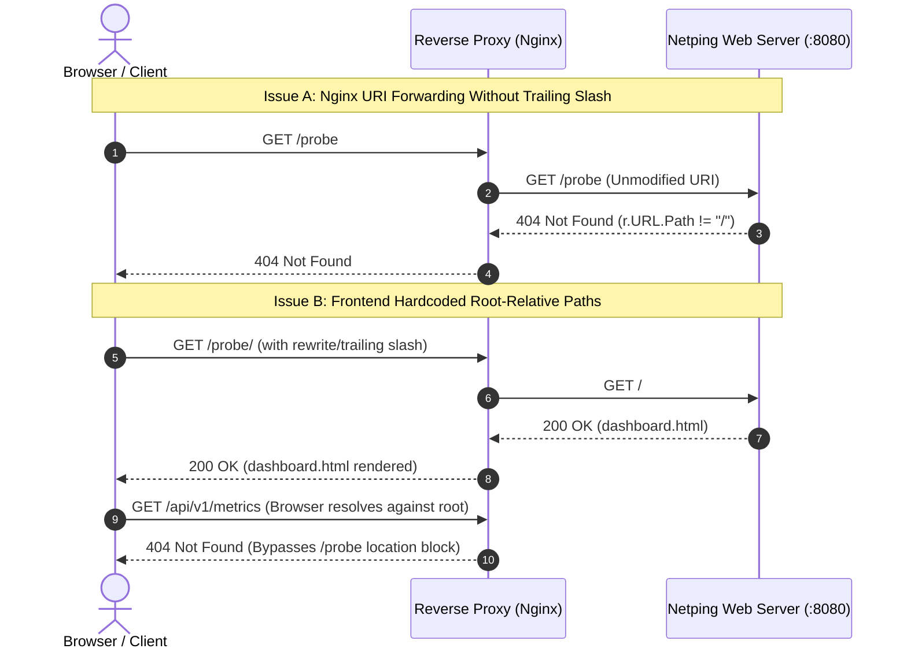
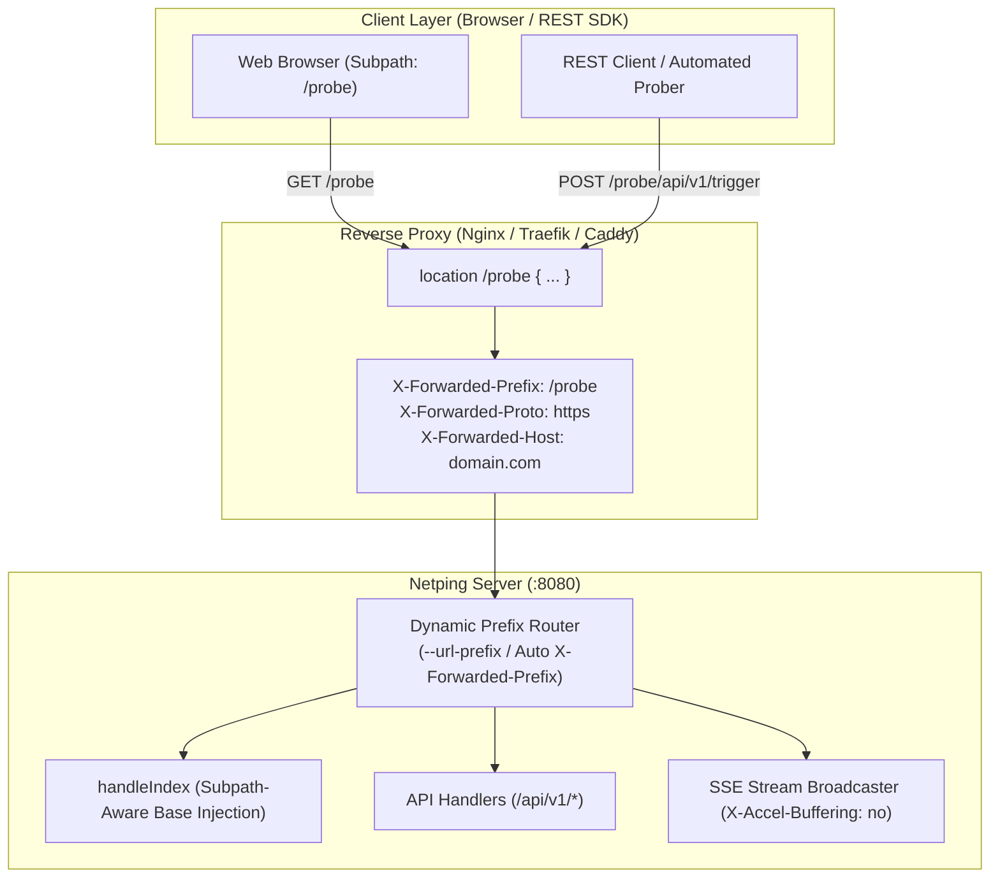

# `netping` — Reverse Proxy & Subpath Routing Engineering Specification

This document provides a comprehensive technical breakdown, architectural analysis, and implementation plan for deploying the `netping` Web Dashboard and REST Trigger API behind modern reverse proxies (Nginx, Traefik, Caddy, HAProxy, Envoy, Apache HTTPD) mounted at arbitrary subpaths (e.g., `/probe`, `/netping`, `/tools/latency`).

---

## 1. Problem Formulation & Root-Cause Analysis

When deploying `netping` behind a reverse proxy location block such as:

```nginx
location /probe {
    proxy_pass http://127.0.0.1:8080;
}
```

The Web Dashboard fails with **404 Not Found** errors across page loading, REST API queries, and Server-Sent Events (SSE) streaming. This failure stems from two independent architectural mechanisms:



### 1.1. Issue A: Proxy Pass-Through vs. Prefix-Stripping
In standard Nginx syntax:
- `proxy_pass http://127.0.0.1:8080;` (without a trailing slash): Nginx forwards the **original, unmodified request URI** (`/probe/...`) to the upstream daemon.
- In `netping`'s HTTP routing engine (`pkg/web/server.go`), routes are registered at root (`/`, `/api/v1/health`, etc.). The root catch-all handler (`handleIndex`) asserts:
  ```go
  if r.URL.Path != "/" {
      http.NotFound(w, r)
      return
  }
  ```
- Because `/probe != "/"`, the request immediately fails with `404 Not Found`.

### 1.2. Issue B: Frontend Absolute Root-Relative Endpoints
If Nginx is configured to strip the subpath prefix (`proxy_pass http://127.0.0.1:8080/;` with a trailing slash):
- Nginx rewrites `GET /probe/` to `GET /` and successfully retrieves `dashboard.html`.
- However, inside the embedded HTML/JavaScript (`pkg/web/dashboard.html`):
  - Initial telemetry snapshot: `fetch('/api/v1/metrics')`
  - Real-time event stream: `new EventSource('/api/v1/stream')`
  - Telemetry exports: `fetch('/api/v1/export')`
  - Telemetry resets: `fetch('/api/v1/reset')`
  - Swagger UI spec: `url: "/api/openapi.json"`
- The browser evaluates all `/api/v1/...` calls as absolute paths relative to the domain root (`http://domain.com/api/v1/metrics`), completely bypassing the `/probe` reverse proxy block and hitting Nginx's default root server, returning **404 Not Found**.

---

## 2. Architecture & Design Principles



---

## 3. Detailed Implementation Plan & Best Practices

### 3.1. Backend Base-Path & Prefix Routing

#### 3.1.1. CLI Configuration Flag & Environment Variable
Add `--url-prefix` (with `--base-path` alias) and `NETPING_URL_PREFIX` in `internal/config/config.go`:

```go
type Config struct {
    // ... existing fields ...
    URLPrefix string // Normalized URL subpath prefix (e.g. "/probe")
}
```

- **Normalization Logic**:
  ```go
  func NormalizeURLPrefix(raw string) string {
      clean := strings.TrimSpace(raw)
      if clean == "" || clean == "/" {
          return ""
      }
      if !strings.HasPrefix(clean, "/") {
          clean = "/" + clean
      }
      return strings.TrimRight(clean, "/")
  }
  ```

#### 3.1.2. Prefix Routing Handler in `pkg/web/server.go`
Wrap the internal `http.ServeMux` to handle subpath matching, automatic trailing-slash redirection, and fallback:

```go
func (s *Server) ServeHTTP(w http.ResponseWriter, r *http.Request) {
    prefix := s.urlPrefix

    if prefix != "" {
        // Exact match without trailing slash -> Redirect to /probe/
        if r.URL.Path == prefix {
            http.Redirect(w, r, prefix+"/", http.StatusMovedPermanently)
            return
        }

        // Subpath request -> Strip prefix for internal ServeMux routing
        if strings.HasPrefix(r.URL.Path, prefix+"/") {
            r2 := new(http.Request)
            *r2 = *r
            r2.URL = new(url.URL)
            *r2.URL = *r.URL
            r2.URL.Path = strings.TrimPrefix(r.URL.Path, prefix)
            if r2.URL.Path == "" {
                r2.URL.Path = "/"
            }
            s.mux.ServeHTTP(w, r2)
            return
        }

        // Request doesn't match configured prefix
        http.NotFound(w, r)
        return
    }

    s.mux.ServeHTTP(w, r)
}
```

#### 3.1.3. Server-Sent Events (SSE) Proxy Optimization Header
In `handleStream` (`pkg/web/server.go`), add `X-Accel-Buffering: no`:
```go
w.Header().Set("Content-Type", "text/event-stream")
w.Header().Set("Cache-Control", "no-cache, no-transform")
w.Header().Set("Connection", "keep-alive")
w.Header().Set("X-Accel-Buffering", "no") // Prevents Nginx/proxy buffer stalling for SSE
```

#### 3.1.4. Swagger UI / OpenAPI Documentation Dynamic Pathing
In `handleAPIDocs` (`pkg/web/server.go`), dynamically resolve the OpenAPI spec relative to the active document URL:
```javascript
window.onload = function() {
  const specURL = window.location.pathname
    .replace(/\/(docs|swagger|api\/docs)\/?$/i, '')
    .replace(/\/+$/, '') + '/api/openapi.json';

  SwaggerUIBundle({
    url: specURL,
    dom_id: '#swagger-ui',
    presets: [SwaggerUIBundle.presets.apis, SwaggerUIBundle.SwaggerUIStandalonePreset],
    layout: "BaseLayout",
    deepLinking: true
  });
};
```

---

### 3.2. Frontend Subpath Resolution (`pkg/web/dashboard.html`)

#### 3.2.1. Robust Dynamic Base Path Resolution
Ensure the base path handles `/`, `/probe/`, `/probe`, and `/probe/index.html` cleanly:

```javascript
// Resolves the active base subpath dynamically
const getBasePath = () => {
  let path = window.location.pathname;
  // Strip trailing filename (e.g. index.html)
  path = path.replace(/\/index\.html?$/i, '');
  // Strip trailing slashes
  return path.replace(/\/+$/, '');
};

// Generates subpath-aware API URLs
const api = (endpoint) => {
  const base = getBasePath();
  const cleanEndpoint = endpoint.startsWith('/') ? endpoint : '/' + endpoint;
  return `${base}${cleanEndpoint}`;
};
```

#### 3.2.2. Updated API & Stream Call References

| Call Location | Original Code | Updated Subpath-Aware Code |
| :--- | :--- | :--- |
| **Initial Metrics** | `fetch('/api/v1/metrics')` | `fetch(api('/api/v1/metrics'))` |
| **SSE Event Stream** | `new EventSource('/api/v1/stream')` | `new EventSource(api('/api/v1/stream'))` |
| **Stream Export Link** | `const url = '/api/v1/export?...'` | `const url = api('/api/v1/export?...')` |
| **Host Export Save** | `fetch('/api/v1/export', ...)` | `fetch(api('/api/v1/export'), ...)` |
| **Telemetry Reset** | `fetch('/api/v1/reset', ...)` | `fetch(api('/api/v1/reset'), ...)` |
| **Swagger UI Link** | `href="/docs"` | `href="docs"` (relative) or `href=api('/docs')` |

---

## 4. Production Reverse Proxy Configuration Recipes

### 4.1. Nginx

#### Mode 1: Pass-Through with Backend `--url-prefix` (Recommended)
`netping` command:
```bash
netping --web --web-addr 127.0.0.1:8080 --url-prefix /probe
```

Nginx configuration:
```nginx
location /probe {
    proxy_pass http://127.0.0.1:8080;
    proxy_http_version 1.1;

    proxy_set_header Host $host;
    proxy_set_header X-Real-IP $remote_addr;
    proxy_set_header X-Forwarded-For $proxy_add_x_forwarded_for;
    proxy_set_header X-Forwarded-Proto $scheme;

    # SSE Real-Time Telemetry Settings
    proxy_set_header Connection '';
    proxy_buffering off;
    proxy_cache off;
    chunked_transfer_encoding off;
    proxy_read_timeout 86400s;
}
```

#### Mode 2: Nginx Prefix-Stripping (Zero Backend Configuration)
`netping` command:
```bash
netping --web --web-addr 127.0.0.1:8080
```

Nginx configuration:
```nginx
location /probe/ {
    proxy_pass http://127.0.0.1:8080/;
    proxy_http_version 1.1;

    proxy_set_header Host $host;
    proxy_set_header X-Real-IP $remote_addr;
    proxy_set_header X-Forwarded-For $proxy_add_x_forwarded_for;
    proxy_set_header X-Forwarded-Proto $scheme;

    # SSE Real-Time Telemetry Settings
    proxy_set_header Connection '';
    proxy_buffering off;
    proxy_cache off;
    chunked_transfer_encoding off;
    proxy_read_timeout 86400s;
}
```

---

### 4.2. Caddy v2

```caddyfile
example.com {
    handle_path /probe/* {
        reverse_proxy 127.0.0.1:8080 {
            flush_interval -1
        }
    }
}
```

---

### 4.3. Traefik v2 / v3

```yaml
http:
  routers:
    netping-subpath:
      rule: "Host(`example.com`) && PathPrefix(`/probe`)"
      service: netping-svc
      middlewares:
        - netping-stripprefix

  middlewares:
    netping-stripprefix:
      stripPrefix:
        prefixes:
          - "/probe"
        forceSlash: true

  services:
    netping-svc:
      loadBalancer:
        servers:
          - url: "http://127.0.0.1:8080"
```

---

### 4.4. HAProxy

```haproxy
frontend http-in
    bind *:80
    acl is_netping path_beg /probe
    use_backend netping_backend if is_netping

backend netping_backend
    http-request replace-path /probe(/)?(.*) /\2
    server netping1 127.0.0.1:8080 check
```

---

## 5. Verification & Testing Matrix

| Test Case | Execution Method | Expected Behavior |
| :--- | :--- | :--- |
| **Root Deployment (`/`)** | `GET /` & `GET /api/v1/health` | Dashboard and API resolve directly at `/`. |
| **Configured Prefix (`--url-prefix /probe`)** | `GET /probe/` & `GET /probe/api/v1/health` | Returns 200 OK; all JS calls use `/probe/api/v1/...`. |
| **Trailing Slash Redirect** | `GET /probe` | Returns `301 Moved Permanently` to `/probe/`. |
| **SSE Stream Stability** | `GET /probe/api/v1/stream` | Continuous event stream without buffering stalls. |
| **Swagger / OpenAPI UI** | `GET /probe/docs` | Swagger UI loads `/probe/api/openapi.json` correctly. |
| **Static Analysis & Audit** | `code_audit.sh --auto --fix` | `[PASSED] ALL CONTROLS COMPLIANT` (0 issues). |
| **Race Detector** | `go test -race ./...` | 0 data races under concurrent subpath requests. |
