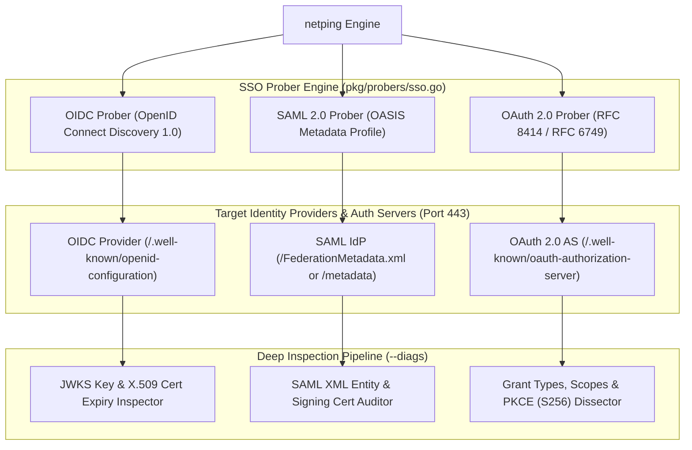
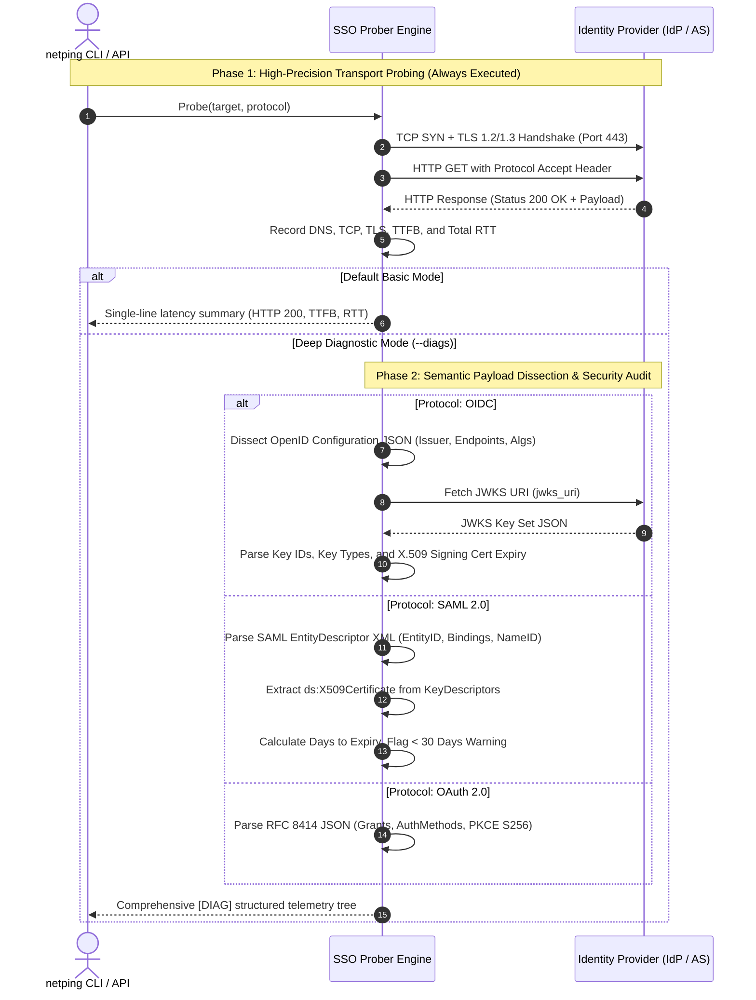

# Single Sign-On (SSO) Protocol Probing Architecture & Implementation Guide
### OpenID Connect (OIDC), SAML 2.0 & OAuth 2.0 Authorization Server

This document provides the complete, exhaustive architectural blueprint, protocol specifications, metadata parsing engines, security auditing rules, and verification methodology for **Single Sign-On (SSO)** protocol support in `netping`.

---

## 1. Executive Overview & Scope

Modern enterprise infrastructure and SaaS applications rely on three foundational federated identity and authorization protocols:

1. **OpenID Connect (OIDC 1.0)**: Identity and authentication layer built on top of OAuth 2.0, utilized across modern SPAs, mobile applications, cloud-native services, and social login providers (Google, Apple, Microsoft, GitHub).
2. **SAML 2.0 (Security Assertion Markup Language)**: Enterprise identity federation standard utilized for B2B SaaS integrations with corporate Identity Providers (Microsoft Entra ID / Azure AD, Okta, Ping Identity, CyberArk, Shibboleth).
3. **OAuth 2.0 (RFC 6749 / RFC 8414)**: Delegation and authorization framework utilized for API protection, machine-to-machine service accounts (Client Credentials flow), and microservice token issuance.

`netping` provides native, high-precision latency probing and deep protocol diagnostics (`--diags`) for all three identity architectures on standard **Port 443 (HTTPS)**.



---

## 2. Architectural Division: Basic Probe vs `--diags`

`netping` enforces a strict separation of concerns between lightweight network health checks and deep protocol inspection:



---

## 3. Protocol Specifications & Deep Diagnostics

### 3.1. OpenID Connect (OIDC 1.0)

#### Standards & Specifications:
- **OpenID Connect Core 1.0**
- **OpenID Connect Discovery 1.0**
- **RFC 7517 (JSON Web Key / JWK)**
- **RFC 7518 (JSON Web Algorithms / JWA)**

#### Default URI Path Resolution:
If no custom path is specified, `netping` appends `/.well-known/openid-configuration` to the target host:
- `https://accounts.google.com` $\rightarrow$ `https://accounts.google.com/.well-known/openid-configuration`
- `https://login.microsoftonline.com/{tenant}/v2.0` $\rightarrow$ `https://login.microsoftonline.com/{tenant}/v2.0/.well-known/openid-configuration`

#### Basic Probing Mode:
- **Request**: HTTP GET with `Accept: application/json`.
- **Validation**: HTTP 200 OK, `Content-Type: application/json`, non-empty JSON body.
- **Output**:
  ```text
  ● Reply from accounts.google.com (142.250.190.45) on port 443: HTTP_status=200 TTFB=21.40 ms time=45.12 ms
  ```

#### Deep Diagnostic Mode (`--diags`):
- **Metadata Fields Parsed**:
  - `issuer`: Canonical identity authority URL.
  - `authorization_endpoint`: Interactive user login and consent endpoint.
  - `token_endpoint`: Token issuance endpoint.
  - `userinfo_endpoint`: User claims endpoint.
  - `jwks_uri`: Public cryptographic signing keys repository.
  - `id_token_signing_alg_values_supported`: Supported token signature algorithms (e.g. `RS256`, `ES256`, `PS256`, `EdDSA`).
  - `scopes_supported`: Advertised scopes (`openid`, `profile`, `email`, `offline_access`).
  - `subject_types_supported`: Subject identifier modes (`public`, `pairwise`).
- **JWKS Deep Key Inspection**:
  - Automatically queries the discovered `jwks_uri`.
  - Dissects keys array: Key ID (`kid`), Key Type (`kty`: `RSA`, `EC`, `OKP`), Key Usage (`use: sig`).
  - Parses `x5c` certificate chains, extracts `NotAfter`, and computes **Days Remaining Until Expiry**.
  - Flags critical alerts if certificate expires within 30 days: `[WARNING: JWKS Cert Expires in 14 Days]`.
- **Diagnostic Output**:
  ```text
  ● Reply from accounts.google.com (142.250.190.45) on port 443: HTTP_status=200 TTFB=21.40 ms time=45.12 ms
    └─ [DIAG] Protocol: OIDC (Discovery 1.0) │ Issuer: https://accounts.google.com │ TokenEndpoint: https://oauth2.googleapis.com/token │ AuthEndpoint: https://accounts.google.com/o/oauth2/v2/auth │ SigningAlgs: [RS256] │ Scopes: [openid, email, profile] │ JWKS: 3 active keys (nearest cert expires in 118 days)
  ```

---

### 3.2. SAML 2.0 (Security Assertion Markup Language)

#### Standards & Specifications:
- **OASIS SAML v2.0 Core & Bindings**
- **OASIS SAML v2.0 Metadata Profile (`urn:oasis:names:tc:SAML:2.0:metadata`)**
- **W3C XML Signature Syntax and Processing (`http://www.w3.org/2000/09/xmldsig#`)**

#### Default URI Path Resolution:
`netping` attempts standard federation metadata endpoints:
- Microsoft Entra ID: `/FederationMetadata/2007-06/FederationMetadata.xml`
- Standard IdP: `/metadata`, `/saml/metadata`, `/idp/metadata.xml`

#### Basic Probing Mode:
- **Request**: HTTP GET with `Accept: application/samlmetadata+xml, application/xml, text/xml`.
- **Validation**: HTTP 200 OK, XML content type, root `<EntityDescriptor>` or `<EntitiesDescriptor>` tag.
- **Output**:
  ```text
  ● Reply from sso.corp.example.com (10.10.5.20) on port 443: HTTP_status=200 TTFB=16.80 ms time=32.45 ms
  ```

#### Deep Diagnostic Mode (`--diags`):
- **Metadata Fields Parsed**:
  - `entityID`: Unique URI identifier of the Identity Provider or Service Provider.
  - `validUntil` / `cacheDuration`: Cache validity window.
  - `IDPSSODescriptor` / `SPSSODescriptor`: SSO role descriptor.
  - `SingleSignOnService`: Supported protocol bindings (`urn:oasis:names:tc:SAML:2.0:bindings:HTTP-Redirect`, `HTTP-POST`, `HTTP-Artifact`).
  - `SingleLogoutService`: SLO redirect and post bindings.
  - `NameIDFormat`: Supported identity formats (`urn:oasis:names:tc:SAML:1.1:nameid-format:emailAddress`, `persistent`, `transient`, `unspecified`).
- **X.509 Signing & Encryption Certificate Audit**:
  - Traverses `<KeyDescriptor use="signing">` and `<KeyDescriptor use="encryption">`.
  - Decodes base64 payload from `<ds:X509Certificate>` into `crypto/x509.Certificate`.
  - Extracts Subject Common Name (`CN`), Issuer Organization (`O`), and Validity Window (`NotBefore` $\rightarrow$ `NotAfter`).
  - **Expiration Alert Classification**:
    - If expired: `[CRITICAL: SAML Signing Cert EXPIRED on YYYY-MM-DD]`
    - If expiring in $< 30$ days: `[WARNING: SAML Signing Cert Expires in X Days]`
    - If valid: `Expires: YYYY-MM-DD (X days left)`
- **Diagnostic Output**:
  ```text
  ● Reply from sso.corp.example.com (10.10.5.20) on port 443: HTTP_status=200 TTFB=16.80 ms time=32.45 ms
    └─ [DIAG] Protocol: SAML 2.0 Metadata │ EntityID: https://sso.corp.example.com/idp │ Bindings: [HTTP-Redirect, HTTP-POST] │ NameID: [emailAddress, persistent] │ SigningCert: CN=SSO Signing, Issuer=Corp CA, Expires: 2027-05-12 (624 days left) │ EncryptionCert: Present
  ```

---

### 3.3. OAuth 2.0 Authorization Server

#### Standards & Specifications:
- **RFC 6749 (The OAuth 2.0 Authorization Framework)**
- **RFC 8414 (OAuth 2.0 Authorization Server Metadata)**
- **RFC 7636 (Proof Key for Code Exchange / PKCE)**
- **RFC 7662 (OAuth 2.0 Token Introspection)**
- **RFC 7009 (OAuth 2.0 Token Revocation)**

#### Default URI Path Resolution:
- Metadata Discovery: `/.well-known/oauth-authorization-server`
- Direct Token Endpoint: `/token`, `/oauth/v2/token`, `/oauth2/token`

#### Basic Probing Mode:
- **Request**: HTTP GET with `Accept: application/json`.
- **Validation**: HTTP 200 OK for metadata, or expected HTTP 400/401 token challenge on direct endpoint.
- **Output**:
  ```text
  ● Reply from auth.service.example.com (10.10.8.10) on port 443: HTTP_status=200 TTFB=12.50 ms time=24.10 ms
  ```

#### Deep Diagnostic Mode (`--diags`):
- **Metadata Fields Parsed**:
  - `issuer`: Authorization server identifier.
  - `token_endpoint`: Token issuance URL.
  - `authorization_endpoint`: Authorization request URL.
  - `revocation_endpoint`: RFC 7009 token revocation URL.
  - `introspection_endpoint`: RFC 7662 token introspection URL.
  - `grant_types_supported`: Supported grant flows (`client_credentials`, `authorization_code`, `refresh_token`, `urn:ietf:params:oauth:grant-type:token-exchange`).
  - `token_endpoint_auth_methods_supported`: Client authentication schemes (`client_secret_basic`, `client_secret_post`, `private_key_jwt`, `tls_client_auth`).
  - `code_challenge_methods_supported`: PKCE algorithms (`S256`, `plain`).
- **Security Posture & PKCE Audit**:
  - Verifies whether SHA-256 (`S256`) PKCE is supported.
  - Flags warning if only legacy insecure `plain` PKCE is advertised: `[WARNING: PKCE S256 Not Supported]`.
- **Diagnostic Output**:
  ```text
  ● Reply from auth.service.example.com (10.10.8.10) on port 443: HTTP_status=200 TTFB=12.50 ms time=24.10 ms
    └─ [DIAG] Protocol: OAuth 2.0 (RFC 8414) │ Issuer: https://auth.service.example.com │ TokenEndpoint: /oauth/token │ Grants: [client_credentials, authorization_code, refresh_token] │ AuthMethods: [client_secret_basic, private_key_jwt] │ PKCE: [S256] │ Introspection: /oauth/introspect
  ```

---

## 4. Output Surface Matrix: Basic vs `--diags`

| Mode | Command Example | Output Content | Overhead |
| :--- | :--- | :--- | :---: |
| **Basic (OIDC)** | `netping --host accounts.google.com --protocol oidc` | Target, IP, Port, HTTP Status (200), TTFB, Total RTT | $<1\text{ms}$ |
| **Diags (OIDC)** | `netping --host accounts.google.com --protocol oidc --diags` | Issuer, Endpoints, Signing Algs, Scopes, JWKS key count, nearest X.509 cert expiry date | Deep JSON + JWKS |
| **Basic (SAML)** | `netping --host sso.corp.local --protocol saml` | Target, IP, Port, HTTP Status (200), TTFB, Total RTT | $<1\text{ms}$ |
| **Diags (SAML)** | `netping --host sso.corp.local --protocol saml --diags` | EntityID, SSO/SLO bindings, NameID formats, X.509 Subject DN, Issuer, Validity Days Remaining | Deep XML DOM |
| **Basic (OAuth2)**| `netping --host auth.cloud.local --protocol oauth2` | Target, IP, Port, HTTP Status (200), TTFB, Total RTT | $<1\text{ms}$ |
| **Diags (OAuth2)**| `netping --host auth.cloud.local --protocol oauth2 --diags`| Issuer, Token/Auth/Revocation endpoints, Grants, Auth methods, PKCE S256 status | Deep JSON |

---

## 5. Code Architecture & Implementation (`pkg/probers/sso.go`)

### 5.1. Struct Design & Pinger Interface
The SSO engine implements the centralized [`probers.Pinger`](file:///e:/data/devel/build/code/public/netping/pkg/probers/probers.go#L53) contract:

```go
type SSOType string

const (
    SSO_OIDC   SSOType = "OIDC"
    SSO_SAML   SSOType = "SAML"
    SSO_OAUTH2 SSOType = "OAUTH2"
    SSO_AUTO   SSOType = "SSO"
)

type SSOOptions struct {
    Type         SSOType
    Hostname     string
    IP           netip.Addr
    Port         uint16
    URI          string
    Path         string
    Timeout      time.Duration
    TLSConfig    *tls.Config
    Dialer       *net.Dialer
    FetchJWKS    bool
}

type SSOing struct {
    ssoType   SSOType
    hostname  string
    ip        netip.Addr
    port      uint16
    uri       string
    path      string
    timeout   time.Duration
    tlsConfig *tls.Config
    dialer    *net.Dialer
    client    *http.Client
}
```

### 5.2. Core Probe Lifecycle (`Ping`)
1. **URI Resolution**: Resolves base URL, target IP/Host, port 443 default, and default endpoint path.
2. **HTTP Transport Construction**: Binds custom `net.Dialer`, TLS 1.2/1.3 config, and monotonic timeout context.
3. **Trace Instrumentation**: Captures DNS lookup duration, TCP connection handshake, TLS certificate negotiation, and TTFB.
4. **Response Handling**:
   - Validates HTTP response status code ($200\text{--}299$ or expected challenge $400/401$).
   - If not in diagnostic mode: returns immediately with high-precision timing.
   - If in `--diags` mode: routes payload to protocol-specific parser (`parseOIDCDiagnostics`, `parseSAMLDiagnostics`, `parseOAuth2Diagnostics`).

---

## 6. Factory Registration & Protocol Normalization

### 6.1. Protocol Enum Registrations (`pkg/consts/consts.go`)
```go
const (
    OIDC   Protocol = "OIDC"   // OpenID Connect Discovery 1.0 (Port 443)
    SAML   Protocol = "SAML"   // SAML 2.0 Identity Provider Metadata (Port 443)
    OAUTH2 Protocol = "OAUTH2" // OAuth 2.0 Authorization Server Metadata (Port 443)
    SSO    Protocol = "SSO"    // Unified Single Sign-On Auto-Discovery (Port 443)
)
```

### 6.2. Protocol Aliases & Default Ports (`pkg/consts/protocols.go`)
- **Default Port**: `443` for `OIDC`, `SAML`, `OAUTH2`, and `SSO`.
- **Aliases**:
  - `OIDC`: `oidc`, `openid`, `openid-connect`, `oidc-discovery`
  - `SAML`: `saml`, `saml2`, `saml-idp`, `saml-sp`, `saml-metadata`
  - `OAUTH2`: `oauth2`, `oauth`, `oauth2-as`, `oauth-metadata`
  - `SSO`: `sso`, `single-sign-on`, `federation`

---

## 7. CLI Usage Guide & Examples

### 7.1. Basic Latency Probing
```bash
# OIDC Discovery Probe
netping --host accounts.google.com --protocol oidc

# SAML 2.0 IdP Metadata Probe
netping --host login.microsoftonline.com --uri /common/FederationMetadata/2007-06/FederationMetadata.xml --protocol saml

# OAuth 2.0 Authorization Server Probe
netping --host auth.corp.example.com --protocol oauth2
```

### 7.2. Deep Diagnostic Mode (`--diags`)
```bash
# Deep OIDC Inspection + JWKS Key Audit
netping --host login.microsoftonline.com --protocol oidc --diags

# Deep SAML Metadata Inspection + X.509 Certificate Expiry Check
netping --host sso.corp.example.com --protocol saml --diags

# Deep OAuth 2.0 PKCE & Grant Inspection
netping --host auth.api.example.com --protocol oauth2 --diags
```

---

## 8. Testing & Verification Methodology

### 8.1. Unit & Wire Mock Test Suite (`pkg/probers/sso_test.go`)
1. **OIDC Mock Engine**:
   - In-memory `httptest.Server` serving OIDC discovery document (`/.well-known/openid-configuration`).
   - Mock JWKS server (`/jwks.json`) serving active RSA/EC keys and X.509 certificate chains.
2. **SAML 2.0 Mock Engine**:
   - In-memory HTTP server serving valid SAML 2.0 `EntityDescriptor` XML.
   - Tests certificate expiration calculation for:
     - Valid long-term certificate (e.g. 500 days left).
     - Expiring certificate ($< 30$ days remaining $\rightarrow$ warning alert).
     - Expired certificate ($\rightarrow$ critical alert).
3. **OAuth 2.0 Mock Engine**:
   - In-memory HTTP server serving RFC 8414 JSON metadata.
   - Tests PKCE `S256` detection and legacy `plain` warning.

### 8.2. Cross-Platform Container Integration Suite
- Integrates with standing WSL Docker container `authelia/authelia:4.38` (`authelia-sso` on port 9091).
- Live public tests:
  - Google Accounts OIDC (`accounts.google.com`)
  - Microsoft Entra ID SAML Metadata (`login.microsoftonline.com`)

---

## 9. Implementation Checklist

- [ ] Register `OIDC`, `SAML`, `OAUTH2`, `SSO` constants in `pkg/consts/consts.go` (Total protocols: 55).
- [ ] Register Port 443 and aliases in `pkg/consts/protocols.go`.
- [ ] Implement `SSOing` engine with pure Go JSON/XML/X.509 decoders in `pkg/probers/sso.go`.
- [ ] Wire `SSO` cases in `pkg/probers/factory.go`.
- [ ] Build comprehensive unit test suite in `pkg/probers/sso_test.go` ($\ge 80\%$ coverage).
- [ ] Add live integration tests in `tests/integration/integration_test.go`.
- [ ] Update `README.md`, `ARCHITECTURE.md`, `TESTING.md`, `CHANGELOG.md`.
